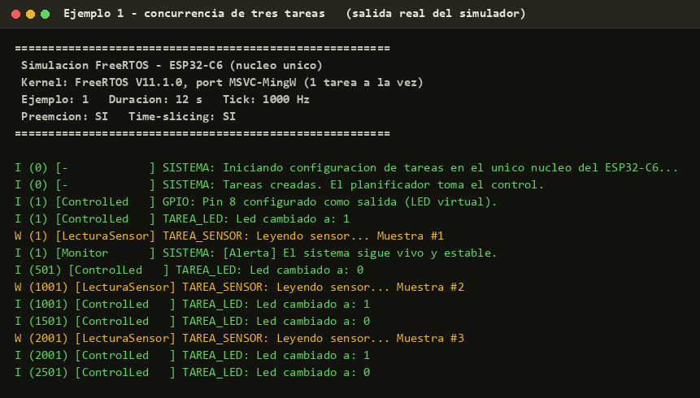
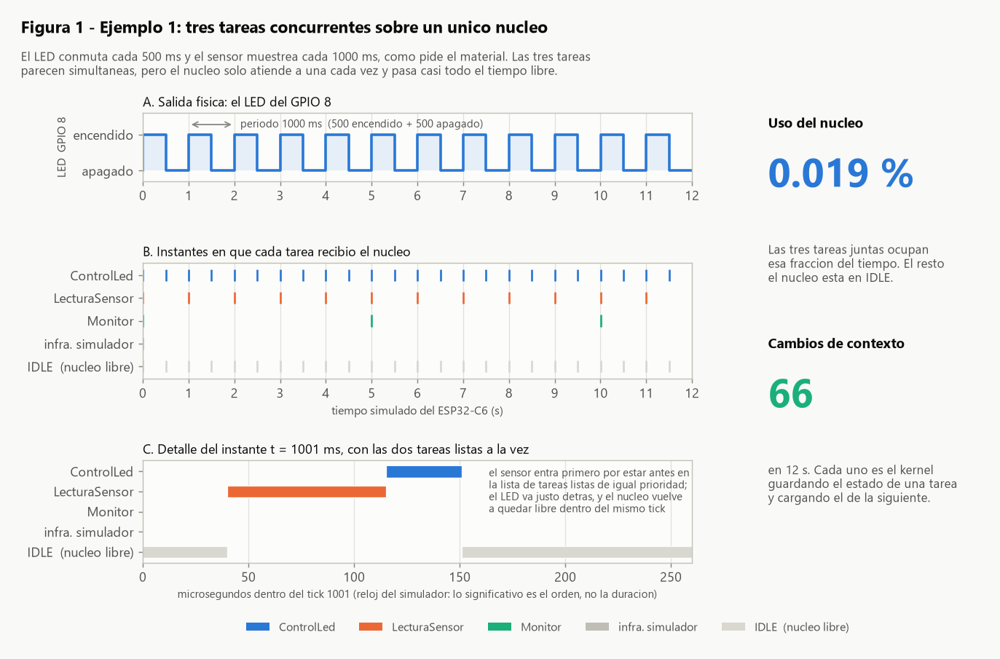
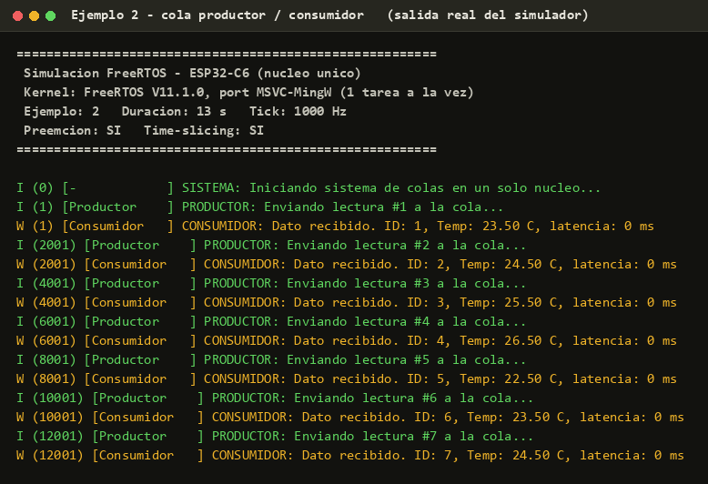
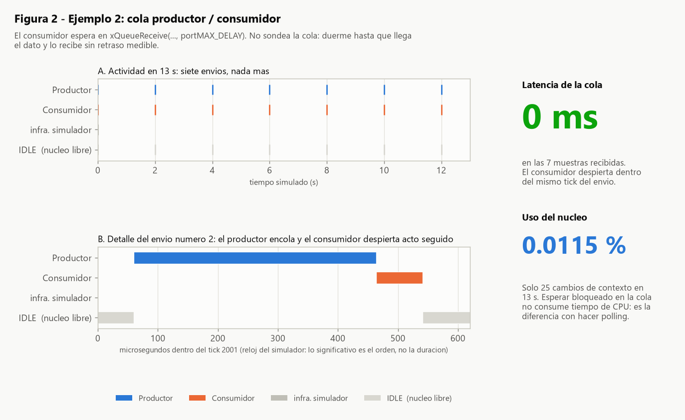
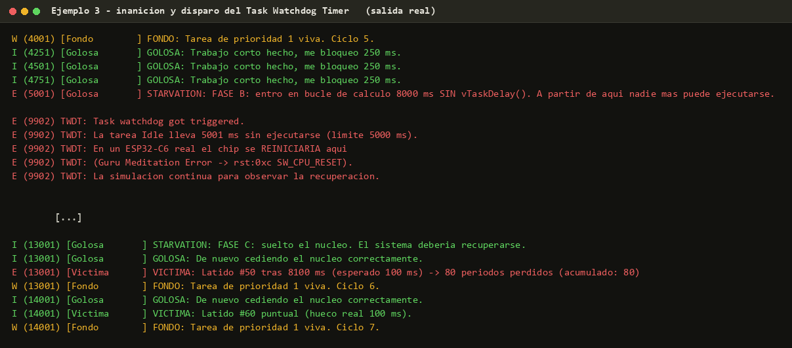
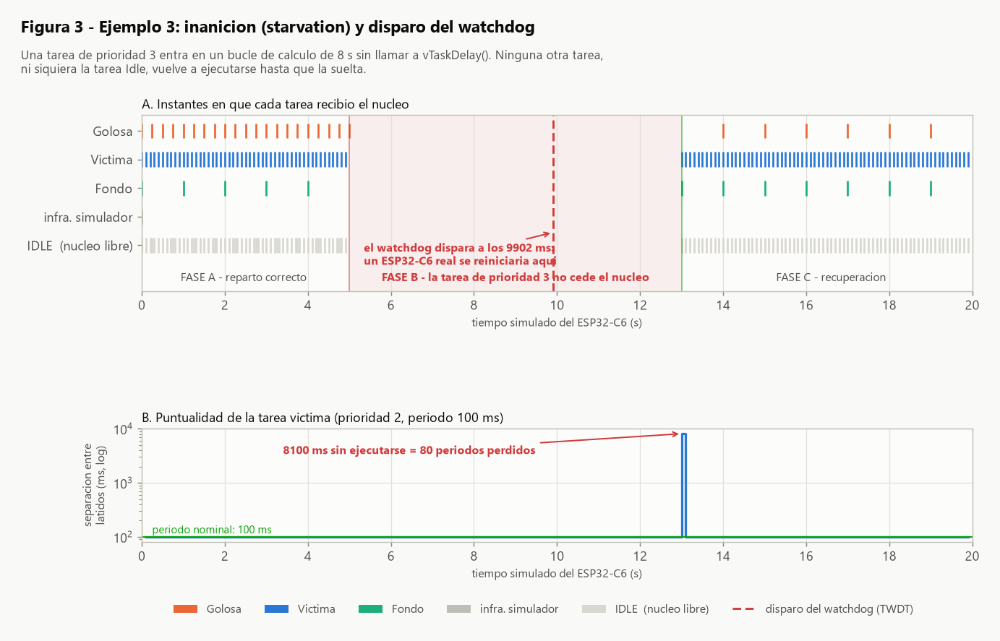
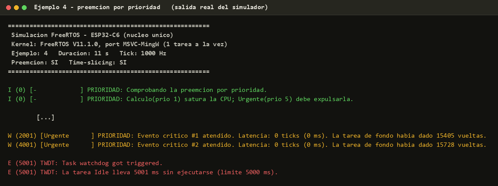
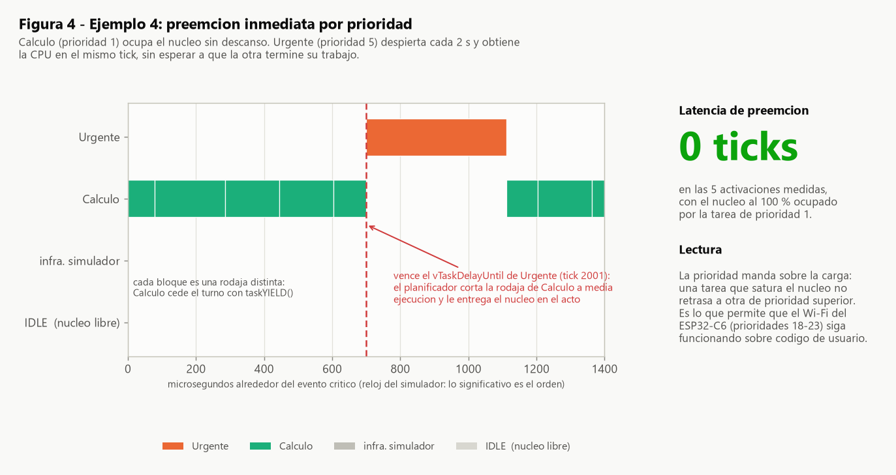
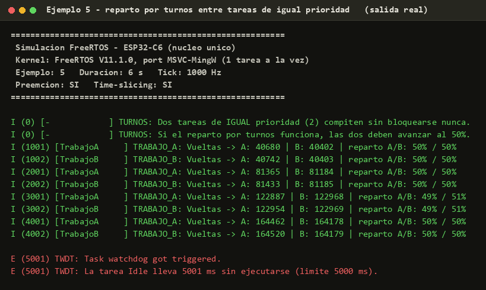
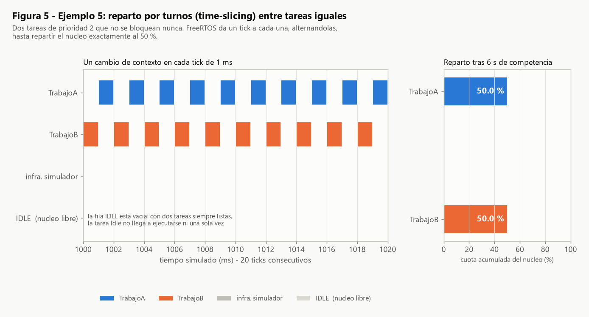

# Informe técnico

## Planificación de tareas con FreeRTOS en un microcontrolador de un solo núcleo (ESP32‑C6)

**Material de partida:** *«En un ESP32 de un solo núcleo, xTaskCreate funciona mediante multitarea por tiempo compartido (time‑slicing) y un sistema de prioridades gestionado por el sistema operativo FreeRTOS»* (documento `.docx`; no se redistribuye en el repositorio, ver `material/LEEME.md`).

**Código y datos:** ver el `README.md` de esta carpeta.

---

## 1. Objeto y alcance

El encargo tiene dos partes:

1. Realizar la **lectura del material**.
2. Realizar los **ejemplos de código** que en él se proponen.

Este informe recoge el desarrollo, los resultados medidos y las conclusiones. Los dos ejemplos del material se han reproducido íntegramente y se han añadido **tres experimentos propios** para poner a prueba, de forma medible, tres afirmaciones que el material enuncia pero no llega a demostrar con código.

### 1.1 Condición de partida y decisión metodológica

**Por qué no se ha usado la placa.** Se dispone de la ESP32‑C6, pero **todavía no tiene soldadas las tiras de pines**, por lo que no puede montarse en protoboard ni conectarse el LED que pide el primer ejemplo del material. No se ha conseguido a nadie que pudiera ayudarnos con el soldado a tiempo para esta entrega.

Esperar a resolver el soldado habría dejado la práctica sin ejecutar, y eso no era una opción aceptable: el material trata sobre **comportamiento temporal del planificador**, y ese comportamiento no se puede acreditar leyendo el código. Había que ejecutarlo y medirlo de alguna manera.

La solución adoptada consiste en compilar **el mismo código de las tareas** para dos destinos distintos:

| Destino | Qué se obtiene | Uso en este informe |
|---|---|---|
| **ESP32‑C6 real** (Arduino / PlatformIO) | Firmware listo para grabar en la placa | Entregable de código; queda pendiente de grabar cuando la placa esté soldada |
| **PC** (kernel real de FreeRTOS, port `MSVC‑MingW`) | Ejecución real del planificador y trazas medibles | **Todos los resultados de este informe** |

El punto clave es que la simulación **no imita** a FreeRTOS: enlaza el **código fuente oficial del kernel** (`tasks.c`, `queue.c`, `list.c`, `timers.c`) en su versión **V11.1.0**, con el port de Windows que Richard Barry mantiene precisamente para este uso. Ese port emula un microcontrolador de un solo núcleo: cada tarea es un hilo de Windows, pero el port garantiza que **solo uno esté ejecutándose en cada instante**, igual que en el C6. Las decisiones de prioridad, el reparto por turnos, el bloqueo en colas y los cambios de contexto son los del planificador auténtico.

Lo que la simulación **sí** cambia respecto al chip está declarado sin ambigüedad en la sección 7.

---

## 2. Lectura del material

### 2.1 Síntesis

El material explica cómo se comporta FreeRTOS cuando hay **una sola CPU** y varias tareas que compiten por ella. Sus ideas centrales:

**El planificador decide por dos criterios, en este orden:**

1. **Prioridad.** FreeRTOS ejecuta siempre la tarea *lista* de prioridad más alta. Si una tarea más importante pasa a estar lista, la actual se detiene de inmediato (preemción).
2. **Reparto de tiempo (*time‑slicing*).** Entre tareas de la *misma* prioridad, el núcleo reparte fragmentos de tiempo por turnos rotativos.

**El cambio de contexto** es el mecanismo físico que hace posible la ilusión de simultaneidad: al pasar de una tarea a otra, el kernel guarda el estado exacto de la que se pausa y carga el de la siguiente.

**La regla de oro del núcleo único.** En un ESP32 de doble núcleo, una tarea que satura un núcleo deja el otro libre para el Wi‑Fi y el resto del sistema. En el C6 no existe ese salvavidas: **toda tarea debe hacer su trabajo lo más rápido posible y bloquearse**, ya sea por tiempo (`vTaskDelay`) o esperando datos (cola o semáforo).

**Las tres formas de ceder el núcleo:**

| Mecanismo | Cuándo usarlo | Coste de CPU mientras espera |
|---|---|---|
| `vTaskDelay()` / `vTaskDelayUntil()` | Trabajo periódico | Cero |
| `xQueueReceive()` / `xSemaphoreTake()` | Esperar un evento o un dato | Cero |
| E/S bloqueante (p. ej. `uart_read_bytes()` con *timeout*) | Esperar al hardware | Cero |

Frente a estos, el **polling** (mirar una variable en un bucle) consume el 100 % del tiempo disponible sin hacer nada útil.

**Los dos riesgos.** Si una tarea no se bloquea nunca:

- **Inanición (*starvation*):** las tareas de prioridad inferior no vuelven a ejecutarse.
- **Watchdog (TWDT):** ESP‑IDF vigila que la tarea *Idle* siga corriendo. Si deja de hacerlo durante más de unos segundos (5 s por defecto), **reinicia el chip**.

**Impacto sobre la radio.** Las tareas internas de Wi‑Fi, Thread y BLE se crean con prioridades muy altas (18–23). Eso protege la comunicación frente al código de usuario, pero implica que **subir una tarea propia por encima de ese rango rompe la conectividad**.

### 2.2 Afirmaciones seleccionadas para verificación

De la lectura se extraen cinco afirmaciones concretas y comprobables. Cada una se ha convertido en un experimento:

| # | Afirmación del material | Experimento |
|---|---|---|
| A1 | Varias tareas parecen ejecutarse a la vez sobre un solo núcleo | Ejemplo 1 (del material) |
| A2 | Una tarea bloqueada en una cola consume 0 % de CPU y despierta al llegar el dato | Ejemplo 2 (del material) |
| A3 | Una tarea que no cede el núcleo provoca inanición y dispara el watchdog | Ejemplo 3 (añadido) |
| A4 | La tarea lista de mayor prioridad expulsa a la actual «de inmediato» | Ejemplo 4 (añadido) |
| A5 | Dos tareas de igual prioridad se reparten el núcleo por turnos rotativos | Ejemplo 5 (añadido) |

Las tres últimas se añaden porque **el material las afirma en prosa pero sus dos ejemplos de código no las demuestran**. En particular, y como se detalla en la sección 6.1, el primer ejemplo del material *no* llega a mostrar time‑slicing.

---

## 3. Desarrollo

### 3.1 Arquitectura del proyecto

El requisito de ejecutar los ejemplos sin placa y a la vez entregar código válido para la placa se resuelve con una **capa de abstracción de cuatro funciones** (`shared/ejemplos_freertos/src/plataforma.h`):

```c
void     plat_log(char nivel, const char *tag, const char *fmt, ...);
void     plat_led_init(int pin);
void     plat_led_write(int pin, int estado);
uint32_t plat_millis(void);
```

Los cinco ejemplos usan exclusivamente esa capa y la API estándar de FreeRTOS. No contienen **ni una línea** dependiente del destino:

```
shared/ejemplos_freertos/src/     ← los 5 ejemplos: UNA sola copia del código
        │
        ├──► firmware/src/plataforma_arduino.cpp   → Serial, pinMode, digitalWrite, millis
        └──► simulacion/shim/plataforma_host.c     → consola, LED virtual, tick de FreeRTOS
```

Esto es lo que permite afirmar que lo medido en el PC describe el mismo código que se grabaría en el C6.

### 3.2 Configuración del kernel en la simulación

Los parámetros se han igualado a los de ESP‑IDF para el ESP32‑C6 (`simulacion/FreeRTOSConfig.h`):

| Parámetro | Valor | Motivo |
|---|---|---|
| `configUSE_PREEMPTION` | 1 | Igual que ESP‑IDF |
| `configUSE_TIME_SLICING` | 1 | Igual que ESP‑IDF; es lo que se pone a prueba en A5 |
| `configTICK_RATE_HZ` | 1000 | Opción `CONFIG_FREERTOS_HZ=1000`, habitual; da resolución de 1 ms para medir latencias |
| `configMAX_PRIORITIES` | 10 | Suficiente para los experimentos |
| `configUSE_TICK_HOOK` | 1 | Necesario para emular el Task Watchdog Timer |

### 3.3 Instrumentación: de dónde salen los datos

Ningún resultado de este informe procede de una estimación. Los datos los emite **el propio kernel**, mediante el punto de enganche oficial de trazas de FreeRTOS:

```c
/* simulacion/FreeRTOSConfig.h */
#define traceTASK_SWITCHED_IN() \
    traza_registrar_switch( pxCurrentTCB->pcTaskName, ( uint32_t ) xTickCount )
```

Esta macro se expande **dentro de `vTaskSwitchContext()`**, es decir, se ejecuta en cada cambio de contexto real. Cada vez que el kernel guarda el estado de una tarea y carga el de otra, deja registrado quién entra y en qué tick. De ahí salen los cronogramas y los porcentajes de ocupación del núcleo.

Se registran dos relojes distintos, que **no se mezclan**:

- **Tick de FreeRTOS** — tiempo *simulado* del microcontrolador. Es el único que representa lo que vería un ESP32‑C6: un `vTaskDelay(500)` son 500 ticks aquí y 500 ticks en el chip. **Todas las cifras del informe usan este reloj.**
- **Reloj de pared del PC (µs)** — sirve únicamente para ordenar lo que ocurre *dentro* de un mismo tick, en las vistas de detalle. Sus duraciones absolutas son las del PC y no se trasladan al chip; así se indica en los ejes correspondientes.

### 3.4 Emulación del Task Watchdog Timer

Para poder observar el riesgo que describe el material se ha reproducido el mecanismo del TWDT de ESP‑IDF con su misma lógica: se vigila cuánto tiempo lleva la **tarea Idle** sin ejecutarse y se compara con el límite por defecto de **5 s**.

La comprobación se hace desde el *tick hook*, que corre en el contexto del tick del sistema. Esto es importante y no es un atajo: le da la misma independencia que tiene un temporizador hardware, de modo que **se dispara aunque una tarea esté acaparando la CPU** — que es exactamente la razón por la que el TWDT real puede detectar la inanición.

La única diferencia deliberada: aquí **no se reinicia** nada, solo se informa, para poder observar también la fase de recuperación. En la placa, ese instante sería un reinicio.

---

## 4. Resultados

Cinco experimentos, ejecutados con `simulacion/ejecutar_todo.sh`. Los ficheros de consola y las trazas CSV en bruto están en `simulacion/salidas/`.

**Sobre la evidencia visual.** Cada experimento se acompaña de dos imágenes:

- Una **captura de la consola** con los ejemplos ejecutándose. El texto es literal: se toma tal cual del fichero `.log` que produjo el programa, sin retocar una sola línea. Lo único añadido es el color por nivel de log (verde/amarillo/rojo), igual que hace el monitor serie de ESP‑IDF.
- Una **figura** construida a partir de las trazas que emitió el kernel, con los cronogramas de ocupación del núcleo y las magnitudes medidas.

Por la razón explicada en 1.1, no son fotografías de la placa: son capturas de los ejemplos corriendo en el simulador. Todo lo necesario para regenerarlas desde cero está en el repositorio (sección 9).

---

### 4.1 Ejemplo 1 — Concurrencia de tres tareas *(ejemplo del material)*

Reproducción fiel del primer ejemplo del documento: `vTareaLed` (prioridad 2, cada 500 ms), `vTareaSensor` (prioridad 2, cada 1000 ms) y una tarea monitor de prioridad 1 cada 5000 ms, que cumple el papel del `while(1)` de `app_main`.





**Resultados medidos (12 s de tiempo simulado):**

| Magnitud | Valor |
|---|---|
| Periodo del LED | 500 ms exactos, sin deriva |
| Periodo del sensor | 1000 ms exactos |
| Periodo del monitor | 5000 ms exactos |
| Cambios de contexto | **66** |
| Ocupación del núcleo | **0,019 %** |

**Lectura.** La afirmación A1 se confirma: las tres tareas mantienen su cadencia sin interferirse, pese a compartir un único núcleo. El detalle interesante está en el panel C de la figura: en el instante *t* = 1001 ms coinciden dos tareas de igual prioridad listas a la vez, y el planificador **no las reparte** — ejecuta una entera, luego la otra, y devuelve el núcleo al reposo, todo dentro del mismo tick.

La cifra que mejor resume el ejemplo es el **0,019 %** de ocupación: el trabajo útil es tan breve que el núcleo pasa el 99,98 % del tiempo en reposo. Ahí está el margen que el material reclama para el Wi‑Fi y las tareas internas del sistema.

---

### 4.2 Ejemplo 2 — Cola productor / consumidor *(ejemplo del material)*

Reproducción fiel del segundo ejemplo. El productor encola una muestra cada 2000 ms; el consumidor espera en `xQueueReceive(..., portMAX_DELAY)` **sin ningún `vTaskDelay()`**. Se ha añadido instrumentación (marca de tiempo dentro de la estructura enviada) para medir la latencia real, que el ejemplo original no mide.





**Resultados medidos (13 s de tiempo simulado):**

| Magnitud | Valor |
|---|---|
| Muestras entregadas | 7 de 7 |
| Latencia envío → recepción | **0 ms** en todas |
| Cambios de contexto | **25** |
| Ocupación del núcleo | **0,0115 %** |

**Lectura.** La afirmación A2 se confirma en sus dos mitades:

- *Coste cero mientras espera.* Solo hubo **25 cambios de contexto en 13 segundos**. Un consumidor equivalente hecho con polling habría estado girando su bucle sin descanso durante los 13 segundos para entregar esas mismas 7 muestras.
- *Despertar inmediato.* La latencia es de 0 ms en las siete entregas: el consumidor se reanuda **dentro del mismo tick** en que el productor encola. El panel B lo muestra a escala de microsegundos — el productor termina su `xQueueSend()` y el consumidor arranca acto seguido, sin pasar por reposo.

Comparando con el ejemplo 1: la mitad de ocupación de núcleo (0,0115 % frente a 0,019 %) con un patrón de comunicación más útil. Es la ventaja concreta de sustituir esperas por bloqueos.

---

### 4.3 Ejemplo 3 — Inanición y watchdog *(experimento añadido)*

Tres tareas: `Golosa` (prioridad 3), `Victima` (prioridad 2, debe latir cada 100 ms) y `Fondo` (prioridad 1). La tarea golosa se porta bien durante 5 s y después entra en un bucle de cálculo de **8 s sin una sola llamada de bloqueo**.





**Resultados medidos (20 s de tiempo simulado):**

| Momento | Suceso |
|---|---|
| 0 – 5001 ms | Fase A: las tres tareas cumplen su cadencia. La víctima late puntual cada 100 ms |
| 5001 ms | La tarea golosa entra en el bucle de cálculo |
| 5001 – 13001 ms | **Ninguna otra tarea se ejecuta.** Ni la víctima, ni la de fondo, ni la tarea Idle |
| **9902 ms** | **Disparo del watchdog:** la tarea Idle lleva **5001 ms** sin ejecutarse |
| 13001 ms | La golosa suelta el núcleo |
| 13001 ms | La víctima informa de **8100 ms** sin ejecutarse = **80 periodos perdidos** |
| 13001 ms en adelante | Fase C: recuperación total e inmediata |

**Lectura.** La afirmación A3 se confirma en los dos frentes. El sistema no se degrada progresivamente: se detiene por completo y se recupera de golpe.

El dato con más consecuencias prácticas es el instante del watchdog: **a los 9902 ms**, es decir, **4,9 segundos antes** de que la tarea golosa terminara su trabajo. En un ESP32‑C6 real el chip se habría reiniciado en ese punto, y el bucle **nunca habría llegado a completarse**. Una función que tarde más de 5 s sin ceder el núcleo no es «lenta»: es una que no termina jamás.

---

### 4.4 Ejemplo 4 — Preemción por prioridad *(experimento añadido)*

`Calculo` (prioridad 1) ocupa el núcleo de forma continua. `Urgente` (prioridad 5) despierta cada 2 s con `vTaskDelayUntil()` y mide cuántos ticks tarda en obtener la CPU desde el instante teórico en que debía despertar.





**Resultados medidos (11 s de tiempo simulado):**

| Magnitud | Valor |
|---|---|
| Activaciones medidas | 5 |
| Latencia de preemción | **0 ticks (0 ms)** en todas |
| Vueltas de la tarea de fondo entre activaciones | ≈ 15 000 |

**Lectura.** La afirmación A4 se confirma, y de la forma más exigente: la latencia es de 0 ticks **con el núcleo al 100 % de carga**. La prioridad domina sobre la ocupación.

El detalle del cronograma lo muestra sin lugar a dudas: la última rodaja de `Calculo` antes del evento aparece **cortada a media ejecución** (97 µs frente a los ~158 µs habituales). El planificador no espera a que termine; la interrumpe.

Este resultado es el que explica el mecanismo que describe el material para la radio: si las tareas de Wi‑Fi corren en prioridades 18–23, ninguna tarea de usuario por debajo de ese rango puede retrasar el procesado de un paquete, por pesada que sea. Y, simétricamente, una tarea de usuario en prioridad 24 sí rompería la comunicación.

---

### 4.5 Ejemplo 5 — Reparto por turnos *(experimento añadido)*

Dos tareas idénticas, `TrabajoA` y `TrabajoB`, ambas de prioridad 2, en bucle de cálculo permanente y **sin ninguna llamada de bloqueo**. Es la única configuración en la que el time‑slicing puede observarse.





**Resultados medidos (6 s de tiempo simulado):**

| Magnitud | Valor |
|---|---|
| Cambios de contexto | **6003** ≈ 1000/s = **uno por tick** |
| Rodajas por tarea | 3000 y 3000 |
| Reparto acumulado | **49,99 % / 50,01 %** |
| Ejecuciones de la tarea Idle | **0** |

**Lectura.** La afirmación A5 se confirma con precisión notable. El cronograma muestra la alternancia estricta A‑B‑A‑B, **un cambio de contexto en cada tick de 1 ms**, que es exactamente el «reparto de pequeños fragmentos de tiempo mediante turnos rotativos» del material. El reparto acumulado se desvía menos de una centésima del 50 %.

Si el time‑slicing no existiera, la primera tarea en arrancar se habría quedado el núcleo y la segunda marcaría cero vueltas. No es lo que ocurre.

---

## 5. Resumen de resultados

| # | Afirmación | Veredicto | Evidencia principal |
|---|---|---|---|
| A1 | Concurrencia aparente sobre un núcleo | **Confirmada** | Periodos exactos; 0,019 % de ocupación |
| A2 | Cola: 0 % de CPU y despertar inmediato | **Confirmada** | 25 cambios de contexto en 13 s; latencia 0 ms |
| A3 | Inanición + reinicio por watchdog | **Confirmada** | 80 periodos perdidos; TWDT a los 9902 ms |
| A4 | Preemción inmediata por prioridad | **Confirmada** | 0 ticks de latencia con la CPU saturada |
| A5 | Time‑slicing entre iguales | **Confirmada** | 6003 cambios de contexto; reparto 49,99 / 50,01 |

---

## 6. Discusión: tres precisiones sobre el material

Los cinco enunciados resultan correctos. La experimentación, sin embargo, saca a la luz tres puntos en los que el material induce a error o se queda corto. Son las aportaciones propias de este trabajo.

### 6.1 El primer ejemplo del material no demuestra el time‑slicing

El documento presenta su primer ejemplo con este comentario en el código:

> `2,  // Prioridad igual para activar el Time-slicing`

Pero en ese ejemplo **el time‑slicing nunca llega a intervenir**. Ambas tareas terminan su trabajo en microsegundos y se bloquean con `vTaskDelay()`; nunca coinciden compitiendo por la CPU. Se turnan **por bloqueo**, no por reparto de tiempo.

La prueba está en el propio experimento: el ejemplo 1 produjo **66 cambios de contexto en 12 s**, mientras que el ejemplo 5 — misma prioridad, pero sin bloquearse — produjo **6003 en 6 s**. Dos órdenes de magnitud de diferencia. El primero es alternancia cooperativa; solo el segundo es time‑slicing.

Poner la misma prioridad a dos tareas *no activa* nada por sí solo: únicamente establece la regla que se aplicará **si alguna vez compiten**.

### 6.2 El peligro del watchdog no es cosa de las prioridades altas

El material asocia repetidamente el riesgo a la prioridad alta:

> «Si una tarea **de alta prioridad** entra en un bucle infinito sin soltar el procesador…»

La medición contradice esa restricción. En el ejemplo 4, la tarea que no se bloquea es `Calculo`, de **prioridad 1 — la más baja de todas las de usuario**. El watchdog se disparó igualmente, a los 5001 ms. Lo mismo ocurrió en el ejemplo 5 con tareas de prioridad 2.

El motivo es que el TWDT no vigila a las tareas de usuario: vigila a la **tarea Idle**, que corre en **prioridad 0**. Cualquier tarea que no se bloquee, sea cual sea su prioridad, deja a Idle sin ejecutarse y acaba reiniciando el chip.

La regla correcta no es *«cuidado con las prioridades altas»*, sino:

> **Toda tarea debe bloquearse, sin excepción de prioridad.**

Esto tiene una consecuencia práctica inmediata en Arduino: `loop()` es el cuerpo de una tarea de FreeRTOS de prioridad 1. Un `loop()` sin `delay()` ni bloqueo es exactamente el caso descrito. Por eso el `loop()` de este firmware contiene un `vTaskDelay()`.

### 6.3 `xTaskCreatePinnedToCore` con un núcleo: el parámetro *no* se ignora

El material afirma:

> «El parámetro del núcleo **se ignora** o se procesa de forma nativa para el único core existente, **sin causar errores**.»

Consultado el código fuente de ESP‑IDF (v5.4, `components/freertos/esp_additions/freertos_tasks_c_additions.h`), la implementación empieza así:

```c
BaseType_t xTaskCreatePinnedToCore( ..., const BaseType_t xCoreID )
{
    configASSERT( taskVALID_CORE_ID( xCoreID ) == pdTRUE || xCoreID == tskNO_AFFINITY );
```

Y la macro de validación (`task.h`):

```c
#define taskVALID_CORE_ID( xCoreID ) \
    ( ( ( ( BaseType_t ) xCoreID ) >= 0 && ( ( BaseType_t ) xCoreID ) < configNUMBER_OF_CORES ) ? pdTRUE : pdFALSE )
```

En el ESP32‑C6, `configNUMBER_OF_CORES` vale 1. Por tanto:

| Valor de `xCoreID` | Comportamiento real |
|---|---|
| `0` | Correcto — aquí sí aplica lo que dice el material |
| `tskNO_AFFINITY` | Correcto |
| **`1`** | **`configASSERT` falla → `abort()` → reinicio del chip** |

El matiz importa porque el error de escribir `1` es fácil al portar código de un ESP32 de doble núcleo, y su síntoma —un reinicio en el arranque— no apunta de forma evidente a su causa. La afirmación es válida para el núcleo 0; no lo es como regla general.

---

## 7. Validez de los resultados

Qué se puede y qué no se puede concluir de la metodología empleada.

**Se traslada al ESP32‑C6 sin reservas** — es el mismo kernel y el mismo código de tareas:

- El orden de ejecución de las tareas y las decisiones de prioridad.
- La alternancia por turnos entre tareas de igual prioridad, un cambio por tick.
- El comportamiento de bloqueo y despertar de las colas.
- Los periodos de `vTaskDelay()` y `vTaskDelayUntil()`, medidos en ticks.
- La lógica de la inanición y el criterio del watchdog (tiempo sin ejecutarse la tarea Idle).

**No se traslada** — depende del hardware:

- **Las duraciones absolutas del código de usuario.** Un bucle que en el PC tarda 158 µs tardará otra cosa en un RISC‑V a 160 MHz. Por eso ninguna conclusión del informe se apoya en esas cifras: las vistas de detalle en microsegundos indican explícitamente en su eje que lo significativo es el **orden**, no la duración.
- **Las cifras de ocupación del núcleo** (0,019 %, 0,0115 %) son órdenes de magnitud, no medidas del chip. Al derivarse del reloj de pared del PC, varían unas milésimas entre ejecuciones; las trazas versionadas en `simulacion/salidas/` son las que corresponden a las cifras de este informe. Las magnitudes medidas en ticks —latencias, periodos, número de cambios de contexto— sí son estables y se repiten exactamente.
- **El comportamiento de la radio.** Las prioridades 18–23 del Wi‑Fi/Thread/BLE no están presentes en la simulación; lo relativo a ellas se apoya en la lectura del material y en la propiedad general de preemción verificada en el ejemplo 4.
- **El LED del GPIO 8** es virtual: se registra la secuencia de encendidos y apagados, no hay una fotografía de un LED físico.
- **El reinicio del watchdog** se informa, no se ejecuta, para poder observar la recuperación.

**Nota sobre el reloj.** El port Win32 no sostiene un tick exacto de 1 kHz — Windows no garantiza temporizadores de 1 ms — por lo que la simulación avanza más despacio que el tiempo real (medido: 15,85 s de reloj por cada 12,00 s simulados, un factor de 1,32). Esto no altera nada relevante: el tiempo *simulado* del microcontrolador es exacto, y es el único que se usa en las medidas. Es la situación normal de cualquier emulador.

---

## 8. Conclusiones

1. **Los dos ejemplos del material funcionan y hacen lo que prometen.** Reproducidos íntegramente, mantienen sus cadencias con exactitud y muestran la concurrencia y el bloqueo eficiente que ilustran.

2. **Las cinco afirmaciones seleccionadas quedan confirmadas experimentalmente**, con medidas tomadas del propio kernel: latencia de preemción de 0 ticks con la CPU saturada, reparto 49,99/50,01 entre iguales, y latencia de cola de 0 ms.

3. **Bloquearse no es una buena práctica: es la condición para que el sistema exista.** La diferencia entre una tarea que se bloquea y una que no, medida aquí, no es de rendimiento sino de supervivencia: en el ejemplo 3 el chip se habría reiniciado 4,9 s antes de que el trabajo terminase.

4. **El riesgo del watchdog es independiente de la prioridad** (sección 6.2). El TWDT vigila a la tarea Idle, de prioridad 0, así que cualquier tarea que no ceda el núcleo lo dispara. La regla del material conviene generalizarla.

5. **Igualar prioridades no «activa» el time‑slicing** (sección 6.1). Solo fija la regla aplicable si las tareas llegan a competir. Distinguir alternancia por bloqueo de reparto por turnos es lo que separa entender el planificador de repetir su vocabulario.

6. **La afirmación sobre `xTaskCreatePinnedToCore` necesita un matiz** (sección 6.3): con `xCoreID = 1` en un chip de un núcleo, ESP‑IDF no ignora el parámetro — falla la aserción y reinicia.

7. **Sobre el método.** Compilar el mismo código contra el kernel real de FreeRTOS en el PC ha permitido medir el comportamiento del planificador con una precisión difícil de obtener incluso con la placa delante, ya que la traza procede del propio `vTaskSwitchContext()`. No sustituye a la validación en hardware —pendiente, y para la que el firmware queda entregado y listo—, pero sí cubre todo lo que es propiedad del planificador y no del silicio.

---

## 9. Reproducibilidad

Todo lo de este informe se regenera con tres órdenes (ver `README.md` para los requisitos previos):

```bash
bash simulacion/compilar.sh          # compila el simulador con el kernel de FreeRTOS
bash simulacion/ejecutar_todo.sh     # ejecuta los 5 experimentos -> simulacion/salidas/
python scripts/generar_figuras.py    # regenera las figuras del informe
python scripts/capturas_consola.py   # regenera las capturas de consola
```

Las trazas en bruto (`*_contexto.csv`, `*_led.csv`, `*_eventos.csv`) quedan en `simulacion/salidas/` y permiten rehacer cualquier cálculo de este informe de forma independiente.

---

## Anexo A — Ficheros de evidencia

| Figura | Fichero | Origen |
|---|---|---|
| Capturas de consola 1–5 | `docs/evidencias/cap*.png` | Texto literal de `simulacion/salidas/ej*_consola.log`, coloreado por nivel |
| Figuras 1–5 | `docs/evidencias/fig*.png` | Generadas de las trazas CSV por `scripts/generar_figuras.py` |
| Logs completos | `simulacion/salidas/ej*_consola.log` | Salida directa del ejecutable |
| Trazas | `simulacion/salidas/ej*_{contexto,led,eventos}.csv` | Emitidas por el kernel vía `traceTASK_SWITCHED_IN` |

## Anexo B — Entorno de trabajo

| Componente | Versión |
|---|---|
| Kernel FreeRTOS | V11.1.0 (fuentes oficiales, port `MSVC-MingW`) |
| Compilador | GCC 16.2.0 (MinGW‑w64, x86_64‑ucrt‑posix‑seh) |
| Framework de la placa | Arduino‑ESP32 3.x vía *pioarduino* (ver `firmware/platformio.ini`) |
| Placa de destino | ESP32‑C6‑DevKitC‑1 (RISC‑V, 1 núcleo, 160 MHz) |
| Figuras | Python 3.13 + matplotlib 3.11.1 + Pillow 11.1.0 |
| Sistema | Windows 10 Pro for Workstations |

## Anexo C — Código de los dos ejemplos del material

Se reproduce aquí el código de los dos ejemplos que pedía el material, para que el informe pueda leerse sin abrir el repositorio. Es exactamente el mismo fichero que compila tanto para el ESP32‑C6 como para el simulador: no hay dos versiones.

Los tres experimentos añadidos (ejemplos 3, 4 y 5) están en la misma carpeta del repositorio, `shared/ejemplos_freertos/src/`.

### C.1 Ejemplo 1 — `ej1_time_slicing.c`

```c
/*
 * EJEMPLO 1 - Concurrencia en un solo nucleo
 * ==========================================
 * Adaptacion fiel del primer ejemplo del material a Arduino-ESP32.
 *
 * Dos tareas de IGUAL prioridad (2) y un monitor de prioridad menor (1),
 * corriendo sobre el unico nucleo RISC-V del ESP32-C6.
 *
 *   vTareaLed     prio 2  - conmuta un LED cada 500 ms
 *   vTareaSensor  prio 2  - simula la lectura de un sensor cada 1000 ms
 *   vTareaMonitor prio 1  - late cada 5000 ms (equivale al while(1) de app_main)
 *
 * Lo que se quiere observar: las tres tareas parecen ejecutarse "a la vez"
 * aunque solo hay un motor de ejecucion. La ilusion la produce el cambio de
 * contexto del planificador, que ocurre cada vez que una tarea se bloquea en
 * vTaskDelay() y cede el nucleo.
 */
#include "freertos/FreeRTOS.h"
#include "freertos/task.h"

#include "plataforma.h"
#include "ejemplos.h"

static const char *TAG = "SISTEMA";

/* GPIO 8: en la mayoria de DevKits del ESP32-C6 es el LED integrado.
 * Ojo: en varias placas ese LED es un WS2812 direccionable, por lo que el
 * material advierte que conviene conectar un LED fisico (con su resistencia
 * de 220-330 ohm) a este pin para ver el parpadeo. */
#ifndef BLINK_GPIO
#define BLINK_GPIO 8
#endif

/* TAREA 1: Parpadeo de un LED (simula control de perifericos) */
static void vTareaLed(void *pvParameters)
{
    (void)pvParameters;

    plat_led_init(BLINK_GPIO);

    uint8_t estado_led = 0;

    while (1) {
        estado_led = !estado_led;
        plat_led_write(BLINK_GPIO, estado_led);
        LOG_I("TAREA_LED", "Led cambiado a: %d", estado_led);

        /* Se bloquea 500 ms: aqui es donde el nucleo queda libre para que
         * corran la Tarea 2, el monitor y las tareas internas del sistema. */
        vTaskDelay(pdMS_TO_TICKS(500));
    }
}

/* TAREA 2: Lectura de un sensor ficticio (simula adquisicion de datos) */
static void vTareaSensor(void *pvParameters)
{
    (void)pvParameters;

    int contador_lecturas = 0;

    while (1) {
        contador_lecturas++;
        LOG_W("TAREA_SENSOR", "Leyendo sensor... Muestra #%d", contador_lecturas);

        /* 1000 ms. Al usar un periodo distinto al de la Tarea 1, el
         * planificador va alternando entre ambas sin saturar el nucleo. */
        vTaskDelay(pdMS_TO_TICKS(1000));
    }
}

/* TAREA 3: Monitor de fondo. Cumple el papel del while(1) de app_main del
 * material. Se le da prioridad 1 (menor que las otras dos) precisamente
 * porque es la menos urgente. */
static void vTareaMonitor(void *pvParameters)
{
    (void)pvParameters;

    while (1) {
        LOG_I(TAG, "[Alerta] El sistema sigue vivo y estable.");
        vTaskDelay(pdMS_TO_TICKS(5000));
    }
}

void ej1_arrancar(void)
{
    LOG_I(TAG, "Iniciando configuracion de tareas en el unico nucleo del ESP32-C6...");

    /* Tarea 1 - Prioridad 2 */
    xTaskCreate(
        vTareaLed,          /* Funcion que ejecuta la tarea       */
        "ControlLed",       /* Nombre identificativo (para debug) */
        2048,               /* Pila. OJO con la unidad: ESP-IDF la
                             * interpreta en BYTES, mientras que el
                             * FreeRTOS original la interpreta en
                             * PALABRAS. El mismo 2048 son 2 KB en el
                             * ESP32-C6 y 8 KB en el simulador de PC. */
        NULL,               /* Parametros de entrada              */
        2,                  /* Prioridad                          */
        NULL                /* Handle (no lo necesitamos aqui)    */
    );

    /* Tarea 2 - MISMA prioridad 2, para que compartan turno */
    xTaskCreate(
        vTareaSensor,
        "LecturaSensor",
        2048,
        NULL,
        2,
        NULL
    );

    /* Tarea 3 - Prioridad 1, monitor de fondo */
    xTaskCreate(
        vTareaMonitor,
        "Monitor",
        2048,
        NULL,
        1,
        NULL
    );

    LOG_I(TAG, "Tareas creadas. El planificador toma el control.");
}
```

### C.2 Ejemplo 2 — `ej2_cola.c`

```c
/*
 * EJEMPLO 2 - Comunicacion entre tareas mediante una Cola (Queue)
 * ==============================================================
 * Adaptacion fiel del segundo ejemplo del material.
 *
 *   vTareaProductora  prio 2 - mide "el sensor" cada 2000 ms y encola el dato
 *   vTareaConsumidora prio 2 - duerme en xQueueReceive(portMAX_DELAY)
 *
 * La idea central del material: el consumidor NO hace polling. Se bloquea
 * indefinidamente y consume 0% de CPU hasta que hay un dato en la cola. En
 * cuanto el productor encola, el planificador lo despierta.
 *
 * Aqui se anade instrumentacion (no presente en el material) para medir la
 * latencia real entre el envio y la recepcion, que es lo que da la evidencia
 * cuantitativa para el informe.
 */
#include "freertos/FreeRTOS.h"
#include "freertos/task.h"
#include "freertos/queue.h"

#include "plataforma.h"
#include "ejemplos.h"

static const char *TAG = "SISTEMA";

/* 1. Estructura de los datos que viajan por la cola */
typedef struct {
    int      id_lectura;
    float    temperatura;
    uint32_t ms_envio;   /* marca de tiempo, para medir la latencia */
} datos_sensor_t;

/* 2. Manejador de la cola */
static QueueHandle_t cola_sensor = NULL;

/* TAREA 1: Productora - mide y envia el dato a la cola */
static void vTareaProductora(void *pvParameters)
{
    (void)pvParameters;

    int contador = 0;
    datos_sensor_t muestra;

    while (1) {
        contador++;

        /* Simulamos la lectura de un sensor */
        muestra.id_lectura  = contador;
        muestra.temperatura = 22.5f + (float)(contador % 5);
        muestra.ms_envio    = plat_millis();

        LOG_I("PRODUCTOR", "Enviando lectura #%d a la cola...", muestra.id_lectura);

        /* Timeout 0: si la cola estuviera llena no nos bloqueamos, avisamos. */
        if (xQueueSend(cola_sensor, &muestra, 0) != pdPASS) {
            LOG_E("PRODUCTOR", "Error: la cola esta llena.");
        }

        /* El productor si usa delay, porque el que marca CADA CUANTO se mide
         * es el propio sensor. */
        vTaskDelay(pdMS_TO_TICKS(2000));
    }
}

/* TAREA 2: Consumidora - espera los datos y los procesa */
static void vTareaConsumidora(void *pvParameters)
{
    (void)pvParameters;

    datos_sensor_t dato_recibido;

    while (1) {
        /* La clave del ejemplo: portMAX_DELAY duerme la tarea de forma
         * indefinida. Mientras la cola este vacia, esta tarea no aparece
         * siquiera en la lista de tareas listas del planificador. */
        if (xQueueReceive(cola_sensor, &dato_recibido, portMAX_DELAY) == pdPASS) {

            uint32_t latencia = plat_millis() - dato_recibido.ms_envio;

            LOG_W("CONSUMIDOR", "Dato recibido. ID: %d, Temp: %.2f C, latencia: %lu ms",
                  dato_recibido.id_lectura,
                  (double)dato_recibido.temperatura,
                  (unsigned long)latencia);

            plat_evento("latencia_cola_ms", latencia);

            /* Al cerrar el ciclo vuelve a xQueueReceive y se duerme otra vez.
             * No hace falta ningun vTaskDelay() en esta tarea. */
        }
    }
}

void ej2_arrancar(void)
{
    LOG_I(TAG, "Iniciando sistema de colas en un solo nucleo...");

    /* 3. La cola se crea ANTES de lanzar las tareas que la usan.
     * Capacidad: 5 estructuras datos_sensor_t. */
    cola_sensor = xQueueCreate(5, sizeof(datos_sensor_t));

    if (cola_sensor != NULL) {
        /* Consumidora primero: arranca, encuentra la cola vacia y se duerme. */
        xTaskCreate(vTareaConsumidora, "Consumidor", 2048, NULL, 2, NULL);
        xTaskCreate(vTareaProductora,  "Productor",  2048, NULL, 2, NULL);
    } else {
        LOG_E(TAG, "Error al crear la cola.");
    }
}
```

### C.3 Capa de abstracción

Las cuatro funciones que permiten compilar ese mismo código para los dos destinos (`shared/ejemplos_freertos/src/plataforma.h`):

```c
/*
 * plataforma.h - Capa de abstraccion minima (HAL)
 *
 * Los ejemplos de este repositorio se compilan SIN CAMBIOS para dos destinos:
 *
 *   1) ESP32-C6 real  -> implementacion en firmware/src/plataforma_arduino.cpp
 *   2) Simulador PC   -> implementacion en simulacion/shim/plataforma_host.c
 *
 * Solo cambia la implementacion de estas cuatro funciones; la logica de las
 * tareas de FreeRTOS (prioridades, delays, colas) es literalmente el mismo
 * codigo en ambos casos. Eso es lo que permite que la evidencia obtenida en el
 * simulador sea representativa del comportamiento en la placa.
 */
#ifndef PLATAFORMA_H
#define PLATAFORMA_H

#include <stdint.h>
#include <stdarg.h>

#ifdef __cplusplus
extern "C" {
#endif

/* Niveles de log equivalentes a ESP_LOGI / ESP_LOGW / ESP_LOGE de ESP-IDF */
void plat_log(char nivel, const char *tag, const char *fmt, ...);

#define LOG_I(tag, ...) plat_log('I', tag, __VA_ARGS__)
#define LOG_W(tag, ...) plat_log('W', tag, __VA_ARGS__)
#define LOG_E(tag, ...) plat_log('E', tag, __VA_ARGS__)

/* LED: en la placa es un GPIO real, en el simulador es un LED virtual cuyo
 * estado se registra en un fichero de traza para poder graficarlo despues. */
void plat_led_init(int pin);
void plat_led_write(int pin, int estado);

/* Milisegundos desde el arranque (equivalente a millis() / esp_timer). */
uint32_t plat_millis(void);

/* Marca un evento con nombre en la traza (se usa para medir latencias). */
void plat_evento(const char *etiqueta, uint32_t valor);

#ifdef __cplusplus
}
#endif

#endif /* PLATAFORMA_H */
```
