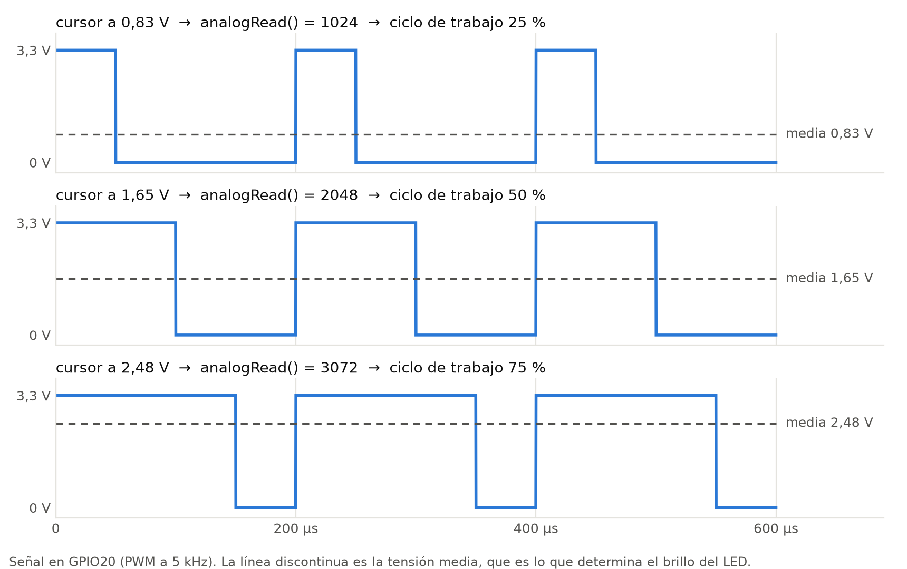
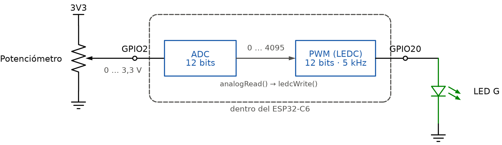
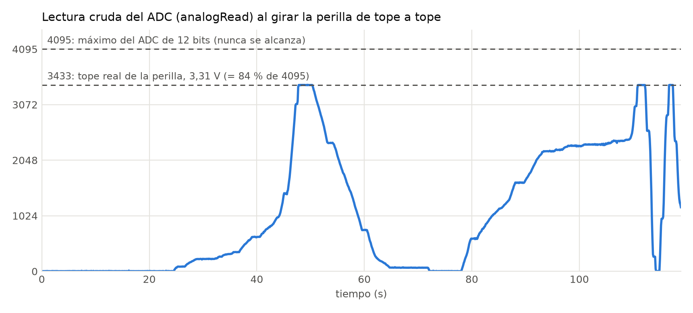
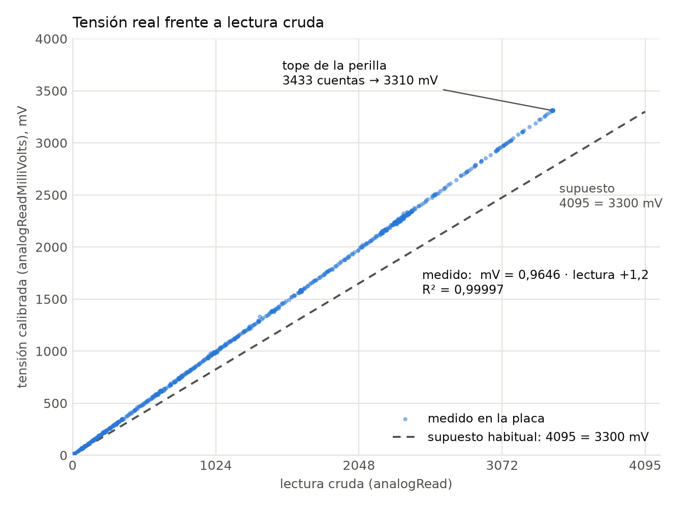
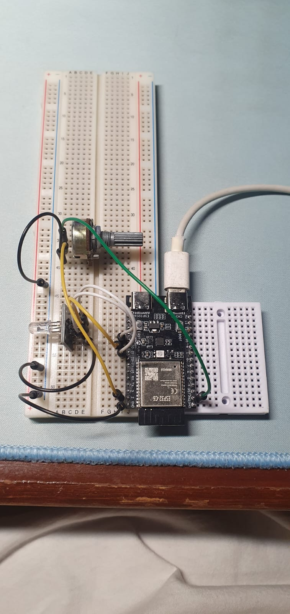

# Informe técnico

## Potenciómetro en una entrada analógica y salida PWM (ESP32‑C6)

**Práctica:** repetir el ejercicio de clase: un potenciómetro conectado a una entrada analógica cuyo valor se lee con la resolución por defecto de 12 bits, y con esa lectura una salida PWM que regula el brillo de un LED.

**Código y datos:** ver el `README.md` de esta carpeta.

---

## 1. Objetivo

- Leer la posición de un potenciómetro con el ADC del ESP32‑C6, con la resolución por defecto de 12 bits.
- Usar esa lectura para generar una señal PWM que regule el brillo de un LED de forma continua, desde apagado hasta el máximo.
- Medir en la placa el comportamiento real del ADC y comprobar que el LED recorre de verdad todo el rango de brillo.

---

## 2. Fundamento

### 2.1 El potenciómetro como divisor de tensión

Un potenciómetro es una resistencia con un tercer terminal, el cursor, que se desliza sobre ella. Con sus extremos conectados a 3V3 y a GND, el cursor entrega una tensión proporcional a su posición:

- perilla en un extremo → 0 V;
- perilla a la mitad → 1,65 V;
- perilla en el otro extremo → 3,3 V.

El potenciómetro usado es de **10 kΩ**. Entre 3V3 y GND circulan siempre 3,3 V / 10 kΩ = **0,33 mA**, sea cual sea la posición. El cursor solo aporta una tensión: no alimenta nada.

### 2.2 El ADC del ESP32‑C6

El ESP32‑C6 tiene un convertidor analógico‑digital (ADC) de aproximaciones sucesivas, con **7 canales en GPIO0–GPIO6**. En Arduino‑ESP32 3.x se lee con dos funciones:

| Función | Devuelve | Qué es |
|---|---|---|
| `analogRead(pin)` | 0 … 4095 | La lectura **cruda** del conversor, con la resolución por defecto de **12 bits** |
| `analogReadMilliVolts(pin)` | mV | La misma conversión **corregida** con la calibración de fábrica que el chip guarda en su eFuse |

Por defecto, el core aplica una **atenuación de 12 dB** en la entrada (`ADC_11db` en Arduino, `ADC_ATTEN_DB_12` en ESP‑IDF 5), que es la que permite medir hasta la tensión de alimentación. Datos de la hoja de datos del ESP32‑C6 (v1.5, tablas 5‑5 y 5‑6):

| Parámetro | Valor |
|---|---|
| Rango de medida con 12 dB (ATTEN3) | 0 … 3300 mV |
| Error total tras la calibración, con 12 dB | ±40 mV |
| No linealidad diferencial (DNL) | −8 … +12 LSB |
| No linealidad integral (INL) | ±10 LSB |
| Frecuencia de muestreo | hasta 100 kSPS |

La hoja de datos indica también que, para mejorar la DNL, conviene **promediar varias lecturas**. Esto se comprueba en la sección 5.5.

### 2.3 PWM: una «salida analógica» con un pin digital

El ESP32‑C6 no tiene conversor digital‑analógico: sus pines solo pueden estar a 0 V o a 3,3 V. La «salida analógica» se obtiene con **modulación por ancho de pulso (PWM)**: el pin conmuta muy deprisa entre 0 y 3,3 V, y la fracción del periodo que pasa en alto, el **ciclo de trabajo**, fija la tensión media. Con un ciclo del 25 %, la media es 0,83 V; con uno del 75 %, 2,48 V.

El LED se enciende y se apaga miles de veces por segundo, y el ojo solo percibe la media: el brillo aparente crece con el ciclo de trabajo.



En el C6, el PWM lo genera el periférico **LEDC**. En Arduino‑ESP32 3.x se configura con `ledcAttach(pin, frecuencia, bits)` y se ajusta con `ledcWrite(pin, ciclo)`. Con 12 bits, el ciclo va de 0 a 4095. El core trata el valor máximo como encendido total: `ledcWrite(pin, 4095)` deja el pin fijo en alto, es decir, al **100 %** (`cores/esp32/esp32-hal-ledc.c`).

---

## 3. Materiales

| Material | Cantidad | Nota |
|---|---|---|
| Placa de desarrollo ESP32‑C6 | 1 | Modelo de Muse Lab, compatible con la ESP32‑C6‑DevKitC‑1 |
| Potenciómetro de 10 kΩ | 1 | De 3 patas |
| Módulo LED RGB de 4 pines | 1 | Cátodo común; se usa el canal verde |
| Protoboard y cables | — | — |
| Cable USB‑C | 1 | Al conector «UART» (CH343) de la placa |

---

## 4. Desarrollo

### 4.1 Asignación de pines

| Señal | Pin | Motivo de la elección |
|---|---|---|
| Cursor del potenciómetro (entrada analógica) | **GPIO2** | Canal 2 del ADC1 |
| Extremos del potenciómetro | **3V3** y **GND** | Rango de 0 a 3,3 V en el cursor |
| LED verde (salida PWM) | **GPIO20** | GPIO de uso general, sin función de arranque |
| LED rojo y azul | GPIO19 y GPIO21 | Se mantienen apagados |
| Común del LED | **GND** | Cátodo común |

**Por qué GPIO2.** Solo GPIO0–GPIO6 llegan al ADC. GPIO4 y GPIO5 son pines de *strapping*, que el chip lee al arrancar, y GPIO0 y GPIO1 son los del cristal opcional de 32 kHz. Quedan GPIO2, GPIO3 y GPIO6; se eligió GPIO2.

### 4.2 Montaje



Orden de conexión, con el USB desconectado:

| # | Desde | Hasta |
|---|---|---|
| 1 | GND de la placa | Pata izquierda del potenciómetro |
| 2 | GPIO2 | Pata central (cursor) |
| 3 | 3V3 de la placa | Pata derecha del potenciómetro |
| 4 | GND de la placa | Pin «−» del módulo LED |
| 5 | GPIO20 | Pin «G» del módulo LED |

Las patas del potenciómetro van en filas distintas de la protoboard. Si 3V3 y GND coincidieran en la misma fila, se provocaría un cortocircuito. Los extremos van a **3V3 y no a 5V**: así el cursor nunca supera los 3,3 V que admite la entrada.

### 4.3 Programa

El programa completo está en el Anexo A. Su núcleo:

```cpp
void setup() {
    analogReadResolution(12);                     // 0..4095 (el valor por defecto)
    analogSetAttenuation(ADC_11db);               // 12 dB: 0..3,3 V
    ledcAttach(PIN_LED_G, 5000, 12);              // PWM de 5 kHz y 12 bits
}

void loop() {
    uint16_t lectura     = analogRead(PIN_POT);           // cruda, 12 bits
    uint32_t milivoltios = analogReadMilliVolts(PIN_POT); // calibrada
    uint32_t ciclo = min(milivoltios, 3300) * 4095 / 3300;
    ledcWrite(PIN_LED_G, ciclo);                          // brillo del LED
    delay(5);
}
```

Decisiones de diseño:

- **1. PWM de 12 bits, la misma resolución que el ADC.** Los 4096 niveles de la entrada se convierten en 4096 niveles de brillo. Con el `analogWrite()` de 8 bits habituales habría solo 256, y a bajo brillo los saltos serían 16 veces más grandes.
- **2. El ciclo se calcula con la tensión calibrada, no con la lectura cruda.** La primera versión pasaba la lectura cruda directamente al PWM. Las medidas en la placa (5.2 y 5.3) demostraron que así el LED no pasa del 84 %. La versión directa sigue en el código para poder comparar: `USAR_TENSION_CALIBRADA = false`.
- **3. PWM a 5 kHz.** Muy por encima de la frecuencia a la que el ojo percibe parpadeo. El programa informa de la frecuencia real que consigue el temporizador.
- **4. Registro para el Serial Plotter.** Cada 100 ms el programa imprime `adc:… mV:… pwm_pct:…`, un formato que el Serial Plotter de Arduino IDE dibuja directamente.
- **5. Prueba de ruido integrada.** Enviando `r` por el monitor serie, el programa toma 1000 lecturas sueltas y 200 promedios de 16, y calcula su dispersión (5.5).
- **6. Fuerza de salida mínima en el pin del LED (~5 mA).** Es la misma protección que en la práctica del pulsador, por si el módulo no trae resistencias.
- **7. `loop()` cede el núcleo 5 ms en cada vuelta.** El LED se actualiza 200 veces por segundo, sin dejar sin CPU a las demás tareas del sistema (práctica de multitareas).

### 4.4 Compilación y grabación

| Resultado | Flash | RAM |
|---|---|---|
| Correcto, sin avisos | 316 280 B (24,1 %) | 15 684 B (4,8 %) |

Entorno: PlatformIO con *pioarduino* 55.03.311, core Arduino‑ESP32 **3.3.11** (ESP‑IDF 5.5.5), placa conectada por el conector «UART» (puerto COM5). El mismo `.ino` se abre sin cambios en Arduino IDE.

---

## 5. Pruebas y resultados

Todas las medidas de esta sección se tomaron en la placa, a través del monitor serie. Los registros completos están en `docs/evidencias/`.

### 5.1 Configuración al arrancar

```
==========================================================
 Potenciometro (ADC) -> brillo de un LED (PWM) - ESP32-C6
 ESP32-C6 rev 2 | 160 MHz | Arduino-ESP32 3.3.11
==========================================================
Entrada  GPIO2 -> ADC1 canal 2 | 12 bits (0..4095) | atenuacion 12 dB (0..3,3 V)
Salida   GPIO20 -> PWM 5000 Hz pedidos, 5000 Hz reales | 12 bits (0..4095)
Ciclo    tension calibrada: 0..3300 mV -> 0..4095 (el tope de la perilla da el 100 %)
         LED de catodo comun | fuerza de salida: nivel 0 de 3 (registros del chip)
```

El pin elegido corresponde al **canal 2 del ADC1**, y el temporizador del PWM consigue exactamente los **5000 Hz** pedidos.

Durante las pruebas apareció un detalle del core: `ledcReadFreq()` devuelve **0 Hz mientras el ciclo de trabajo es 0 %**, porque el core 3.3 lo programa así. Una primera versión de la cabecera, impresa al arrancar con el LED apagado, mostró «0 Hz reales» aunque el PWM funcionaba. Ahora la frecuencia se obtiene al configurar el PWM, con `ledcChangeFrequency()`, que la devuelve siempre.

### 5.2 Barrido con la lectura cruda (primera versión)

Con la primera versión del programa, que pasaba la lectura cruda directamente al PWM, se giró la perilla de tope a tope varias veces durante dos minutos. El registro es `monitor_pruebas.txt`.



| Posición de la perilla | Lectura cruda | Tensión calibrada | Ciclo de trabajo resultante |
|---|---|---|---|
| Tope inferior | 0 … 9 | 0 … 14 mV | 0 … 0,2 % |
| **Tope superior** | **3429 … 3437** (media 3433) | **3307 … 3312 mV** | **83,8 %** |

**Lectura.** El resultado central de la práctica es que **la lectura cruda nunca pasa de ~3433**, aunque el cursor está a los 3,31 V de la alimentación. En la figura 3, las tres subidas al tope se aplanan en el mismo valor, que es el límite físico de la perilla, muy lejos de 4095. Pasando esa lectura tal cual al PWM de 12 bits, **el LED nunca supera el 84 % de su brillo**.

Con el `map(lectura, 0, 4095, 0, 255)` y el `analogWrite()` de 8 bits que se suelen usar en clase, el resultado sería el mismo: un máximo de 214 sobre 255, también el 84 %.

### 5.3 Relación entre lectura cruda y tensión real

Cada línea del registro incluye, junto a la lectura cruda, la tensión calibrada. Con las 1315 muestras del barrido por encima de 50 cuentas:



| Magnitud | Valor |
|---|---|
| Ajuste lineal | mV = 0,9646 · lectura + 1,2 |
| Coeficiente de determinación R² | 0,99997 |
| Dispersión de los puntos respecto al ajuste | 4,6 mV |
| Tensión que correspondería a la lectura 4095 | **≈ 3951 mV** |

**Lectura.** La relación es prácticamente una recta, pero su pendiente es de **0,965 mV por cuenta**, no los 3300 / 4095 = 0,806 mV que se suelen suponer. Con 12 dB de atenuación, en este chip el valor máximo de 4095 corresponde a unos **3,95 V**, una tensión que la placa no puede dar. De ahí sale el techo de 3433 cuentas.

Suponer que 4095 equivale a 3300 mV tiene un error considerable: en el tope de la perilla, la lectura 3433 se interpretaría como 2767 mV cuando en realidad son 3310 mV. Son **543 mV de diferencia, un 16 %**.

### 5.4 Corrección: el ciclo de trabajo se calcula con la tensión calibrada

La versión final del programa calcula el ciclo con `analogReadMilliVolts()`, limitada a 3300 mV y escalada a 0–4095 (sección 4.3). Con los 3307–3312 mV medidos en el tope, el ciclo queda limitado a 4095, es decir, al **100 %**.

| # | Prueba | Resultado esperado | Resultado observado |
|---|---|---|---|
| C1 | Perilla en el tope inferior | `pwm_pct` ≈ 0 %, LED apagado | **Cumple.** `pwm_pct` entre 0,0 y 0,8 % en los 45 s y 10 min grabados en esta posición |
| C2 | Perilla en el tope superior | `pwm_pct` = 100 %, LED al máximo | *pendiente de medir* |
| C3 | Giro completo | El brillo recorre de apagado a máximo sin saltos | *pendiente de medir* |

### 5.5 Ruido del ADC

Con la perilla quieta, en torno a la cuarta parte de su recorrido (lectura ≈ 1017), el programa ejecutó tres veces la prueba de ruido:

| Medida | Lecturas sueltas: desviación típica | Rango (máx − mín) | Promedios de 16: desviación típica | Rango |
|---|---|---|---|---|
| 1ª | 5,09 cuentas | 63 | 1,17 cuentas | 8,2 |
| 2ª | 1,33 cuentas | 29 | 0,36 cuentas | 3,2 |
| 3ª | 1,08 cuentas | 8 | 0,38 cuentas | 3,3 |

**Lectura.** En la primera medida, tomada nada más dejar la perilla, la dispersión fue cuatro veces mayor que en las dos siguientes. Probablemente la mano aún tocaba o movía la perilla. Con la perilla ya en reposo (2ª y 3ª):

- Una lectura suelta varía con una desviación típica de **~1,1–1,3 cuentas**, que con la pendiente medida en 5.3 son **~1,0–1,3 mV**.
- Promediando 16 lecturas, la desviación baja a **~0,37 cuentas**: se reduce entre 2,8 y 3,7 veces. Para ruido aleatorio puro se esperaría una reducción de √16 = 4 veces.

Para regular un LED, ese ruido es irrelevante: una cuenta equivale a **~0,03 %** del ciclo de trabajo, muy por debajo de lo que el ojo puede distinguir. Por eso el programa usa lecturas sueltas. Si el objetivo fuera medir con precisión, sí convendría promediar, como recomienda la hoja de datos.

### 5.6 Entrada analógica sin conectar

Antes de montar el potenciómetro, el programa ya estaba cargado y se registraron 60 s con el GPIO2 **sin nada conectado** (`monitor_gpio2_sin_conectar.txt`):

| Magnitud | Valor |
|---|---|
| Muestras | 599 |
| Lectura mínima / máxima | 18 / 43 |
| Media y desviación típica | 27,8 y 4,3 cuentas |

**Lectura.** Una entrada analógica al aire **no** da lecturas al azar por todo el rango, como cabría esperar. Da un valor bajo y bastante estable, que se confunde con una perilla en el mínimo. Durante la práctica llevó a pensar que el potenciómetro estaba conectado y en su tope inferior cuando no había nada montado. Un cable suelto en el cursor no se delata solo.

### 5.7 Evidencias




---

## 6. Análisis

**La resolución efectiva es menor que la nominal, pero sobra.** Como la lectura cruda solo llega a ~3433, en el rango real de 0 a 3,3 V el ADC distingue unos 3434 niveles, unos 11,7 bits en lugar de 12. Para regular un LED es más que suficiente, y el ruido de ~1 cuenta está al mismo nivel que el escalón.

**Lectura cruda o tensión calibrada.** La lectura cruda es rápida y lineal, pero su escala depende del chip y de la atenuación. La tensión calibrada usa los coeficientes que Espressif graba en cada chip y se expresa en unidades físicas, así que sirve en cualquier placa sin retocar constantes. Cuesta una segunda conversión en cada vuelta de `loop()`, un coste despreciable frente a los 5 ms que dura cada vuelta. A cambio, el tope de la perilla da el 100 % de brillo en cualquier ESP32‑C6.

**Brillo percibido.** El ciclo de trabajo, y con él la corriente media del LED, es proporcional a la tensión del cursor. El brillo que percibe el ojo no lo es: la sensibilidad del ojo no es lineal, y los cambios se notan mucho más a baja intensidad que a alta. Por eso es de esperar que, al girar la perilla, la mayor parte del cambio visible ocurra en la primera parte del recorrido. Si se quisiera un cambio de brillo que se perciba uniforme, habría que aplicar una curva de corrección (corrección gamma) entre la lectura y el ciclo. Queda como mejora posible; no se ha medido porque requeriría un sensor de luz.

---

## 7. Conclusiones

1. **La práctica funciona:** la lectura del potenciómetro con el ADC de 12 bits regula el brillo del LED mediante un PWM de 5 kHz y 12 bits, y el LED responde de forma continua al girar la perilla.
2. **«12 bits» no significa que 0–3,3 V se conviertan en 0–4095.** En el ESP32‑C6, con la atenuación por defecto de 12 dB, el tope de la perilla (3,31 V) dio **3433 cuentas**. Pasando la lectura cruda al PWM, el LED se queda en el **84 %** de su brillo, y lo mismo ocurre con el `map(…, 0, 4095, 0, 255)` habitual.
3. **La relación es lineal, con otra escala.** Tensión real = 0,9646 mV × lectura + 1,2 (R² = 0,99997): el valor 4095 equivaldría a ~3,95 V. Suponer 4095 = 3300 mV comete un error de hasta el 16 %.
4. **La solución es usar la tensión calibrada de fábrica** (`analogReadMilliVolts`) para calcular el ciclo de trabajo. Con ella, el tope de la perilla lleva el PWM al 100 % en cualquier ESP32‑C6.
5. **El ruido del ADC es de ~1 cuenta (~1 mV) y promediar 16 lecturas lo reduce entre 3 y 4 veces.** Para el LED es invisible (~0,03 % de ciclo por cuenta), así que no hace falta filtrar. Para medir, sí.
6. **Una entrada analógica sin conectar no se delata:** leyó 18–43 cuentas estables, un valor que parece una perilla al mínimo. Conviene comprobar el montaje girando la perilla, no mirando una sola lectura.

---

## 8. Reproducibilidad

```bash
# Firmware (desde firmware/)
pio run -t upload
pio device monitor        # 115200 baudios; 'r' = prueba de ruido, 'i' = cabecera

# Figuras y graficas (desde esta carpeta)
python scripts/generar_figuras.py   # figuras 1 y 2 (explicativas)
python scripts/graficas_placa.py    # figuras 3 y 4, desde los registros de la placa

# Version Word de este informe
cd scripts && npm install && node informe_a_docx.js
```

---

## Anexo A — Código fuente completo

Fichero `firmware/potenciometro_pwm/potenciometro_pwm.ino`. Es el único fichero del programa: se abre tal cual en Arduino IDE y es el que compila PlatformIO.

<!-- incluir: ../firmware/potenciometro_pwm/potenciometro_pwm.ino -->

En GitHub: [potenciometro_pwm.ino](../firmware/potenciometro_pwm/potenciometro_pwm.ino)

## Anexo B — Fuentes

| Documento | Uso en este informe |
|---|---|
| Espressif, *ESP32‑C6 Series Datasheet* v1.5, tablas 5‑5 y 5‑6 | Rango del ADC con 12 dB, error tras calibración, DNL, INL, frecuencia de muestreo |
| Espressif, *ESP32‑C6‑DevKitC‑1 User Guide* | Canales ADC de GPIO0–GPIO6, pines de strapping |
| Código fuente de Arduino‑ESP32 3.3.11 | `analogRead`, `analogReadMilliVolts`, `ledcWrite` (encendido total con el valor máximo), `ledcReadFreq` y `ledcChangeFrequency` |
| Registros del monitor serie de la placa (`docs/evidencias/`) | Todas las medidas de la sección 5 |
