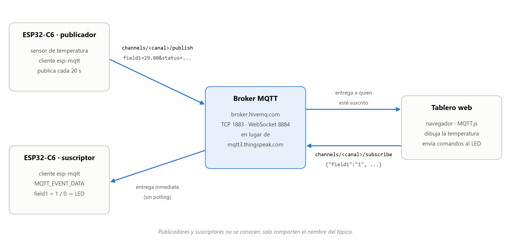

# Protocolo ligero para IoT: MQTT — ESP32‑C6

El ESP32‑C6 se comunica mediante **MQTT**, el protocolo publicador/suscriptor ligero del IoT, con
el SDK oficial **ESP‑IDF v6.1** y su cliente MQTT (`esp-mqtt`). El enunciado usa **ThingSpeak**;
como no fue posible crear la cuenta de MathWorks que exige, la práctica se hizo con un **broker
público sin cuenta** (`broker.hivemq.com`) y un **tablero web** que hace el papel de la página del
canal. El firmware es el mismo: pasar a ThingSpeak es cambiar un archivo de credenciales.

> **[→ Leer el informe técnico](docs/INFORME_TECNICO.md)**
> · También en Word: [`docs/Informe_tecnico_MQTT_ESP32-C6.docx`](docs/Informe_tecnico_MQTT_ESP32-C6.docx)

| Programa | Papel | Qué hace |
|---|---|---|
| [`firmware/publicador/`](firmware/publicador) | Publicador (Ejercicio 1 y punto 2.1) | Lee el **sensor de temperatura integrado** del ESP32‑C6 (mediana de 5 lecturas) y publica el valor cada 20 s en el campo 1 (`field1`) del canal |
| [`firmware/suscriptor/`](firmware/suscriptor) | Suscriptor | Se suscribe al canal y recibe al instante cada dato nuevo, sin consultar periódicamente. Con `field1 = 1` enciende un LED y con `field1 = 0` lo apaga |
| [`tablero/tablero.html`](tablero/tablero.html) | Página del canal | Dibuja la temperatura y envía los comandos del LED. Se abre con doble clic |



**Resultados en la placa** (detalle en el informe):

- **Publicador.** La primera publicación sale a los 17–19 s del reinicio; después, una cada 20 s,
  sin perder ninguna en 15 minutos. El sensor marca 26,8–31,8 °C con una resolución de 1 °C.
- **Lectura anómala.** En la primera versión, una lectura salió a 55,8 °C: un escalón de 27,88 °C
  del DAC del sensor, probablemente porque la radio Wi‑Fi usa el mismo sensor para calibrarse. Por
  eso se publica la mediana de 5 lecturas; después no hubo ninguna anomalía en 225 lecturas.
- **Latencia.** Un mensaje tarda **~180 ms** de la placa al PC y **~237 ms** del PC a la placa.
  Casi todo es el viaje al broker, que está en Fráncfort; los ~60 ms extra de bajada son el ahorro
  de energía del Wi‑Fi.
- **QoS 0.** Los mensajes publicados mientras el suscriptor estaba desconectado (un fallo de DNS
  del que se recuperó solo) se perdieron: con QoS 0, el broker no los guarda.
- **MQTT frente a HTTP.** MQTT gasta 72 bytes por lectura; la petición HTTP equivalente a
  ThingSpeak, 623.

El enunciado del profesor (`Practica.pdf`) no se sube al repositorio: conserva la titularidad de su
autor, como en las prácticas anteriores. Si lo tiene, colóquelo en esta carpeta; el informe resume
lo que pide y cita las partes que se corrigen.

---

## Correcciones al PDF

El texto del PDF parece copiado de la respuesta de un asistente de IA. De ahí vienen el «Usa el
código con precaución» y las dos preguntas del final («¿Qué prefieres hacer a continuación…?»),
que son sugerencias para seguir y no parte del enunciado. Al copiarlo se perdieron también las
direcciones web. El código de esta carpeta aplica estas correcciones:

| En el PDF | Problema | Corrección |
|---|---|---|
| «Para agregar el componente… instrucciones de la documentación» | Desde ESP‑IDF v6.0, `esp-mqtt` ya no viene dentro de ESP‑IDF | `idf.py add-dependency espressif/mqtt` en cada proyecto. Crea `main/idf_component.yml` |
| Broker `://thingspeak.com`, `TS_BROKER_URI "mqtt://://thingspeak.com"` | Falta el nombre del servidor | `mqtt://mqtt3.thingspeak.com` (puerto 1883, sin cifrar) |
| `case MQTT_EVENT_SUBCRIBED:` | Errata: el programa no compila | `MQTT_EVENT_SUBSCRIBED` |
| `strncmp(event->data, "field1=1", 8)` | ThingSpeak no reenvía el texto `field1=1`: reenvía la entrada del canal en JSON (`"field1":"1"`) | Se busca el valor de `"field1"` dentro del JSON |
| URL de prueba `https://thingspeak.com` | Faltan la ruta y la clave | `https://api.thingspeak.com/update?api_key=<WRITE_API_KEY>&field1=1` |
| El publicador envía un 25 fijo, una sola vez | El punto 2.1 pide incorporar un sensor de temperatura | Sensor integrado del C6, publicado cada 20 s. Un canal gratuito acepta un dato cada 15 s como máximo |
| (no lo menciona) | Con Wi‑Fi y MQTT el programa ocupa 1,06 MB y no cabe en la partición de 1 MB por defecto | `CONFIG_PARTITION_TABLE_SINGLE_APP_LARGE=y` en `sdkconfig.defaults` (1,5 MB) |

La línea de `CMakeLists.txt` del PDF (`set(EXTRA_COMPONENT_DIRS …protocol_examples_common)`) es
correcta y está en los dos proyectos.

---

## Cómo ponerlo en marcha

### 1. ESP‑IDF v6.1

En este equipo ya está instalado: ESP‑IDF en `C:\esp\v6.1\esp-idf` y las herramientas en
`%USERPROFILE%\.espressif`. En cada terminal nueva (PowerShell) hay que cargar el entorno una vez:

```powershell
. C:\esp\v6.1\esp-idf\export.ps1
```

Para instalarlo en otro equipo (Git y Python 3.10 o posterior):

```powershell
git clone -b v6.1 --depth 1 --recursive --shallow-submodules https://github.com/espressif/esp-idf.git C:\esp\v6.1\esp-idf
C:\esp\v6.1\esp-idf\install.ps1 esp32c6
```

### 2. Credenciales

Los dos programas leen `firmware/credenciales.h`, que está en `.gitignore`. Se crea copiando una
de las dos plantillas:

| Plantilla | Para | Qué hay que rellenar |
|---|---|---|
| `credenciales.broker_publico.h` | El broker público (como se hizo la práctica) | Nada. Para otra placa, cambie el canal por un texto propio |
| `credenciales.ejemplo.h` | ThingSpeak | Channel ID y las tres credenciales de un dispositivo MQTT (*Devices → MQTT → Add a new device*, con *Allow Publish* y *Allow Subscribe*) |

```powershell
copy firmware\credenciales.broker_publico.h firmware\credenciales.h
```

### 3. Red Wi‑Fi

```powershell
cd firmware\publicador
idf.py menuconfig
```

En **Example Connection Configuration**, escriba **WiFi SSID** y **WiFi Password**. Guarde con
`S` y salga con `Q`. Se guardan en `sdkconfig`, que tampoco se sube. Cada proyecto tiene el suyo:
repita el paso en `firmware\suscriptor`.

- El ESP32‑C6 solo usa redes de **2,4 GHz**.
- Las redes con usuario y contraseña (WPA2‑Enterprise, como *eduroam*) no funcionan con
  `example_connect()`. El punto de acceso del teléfono, en 2,4 GHz, sí funciona.

### 4. Publicador

Placa conectada por el conector **«UART»** (en Windows, *USB-Enhanced-SERIAL CH343*, COM5 en este
equipo):

```powershell
cd firmware\publicador
idf.py -p COM5 build flash monitor
```

Para salir del monitor: `Ctrl + ]`. Abra [`tablero/tablero.html`](tablero/tablero.html) con doble
clic: se conecta solo y en menos de 20 s aparece la primera lectura. Con ThingSpeak, la gráfica
está en la pestaña *Private View* del canal.

### 5. Suscriptor

```powershell
cd firmware\suscriptor
idf.py -p COM5 build flash monitor
```

Con el broker público, use los botones **Encender** y **Apagar** del tablero. Con ThingSpeak,
envíe el dato desde el navegador:
`https://api.thingspeak.com/update?api_key=<WRITE_API_KEY>&field1=1` (con al menos 15 s entre
dos envíos).

LED opcional: el canal **G** del módulo RGB de las prácticas anteriores en **GPIO20** y su común
en **GND**. Sin LED, la acción se ve igual en el monitor.

---

## Revisión presencial: guion de la demostración

**Antes de la clase**

1. Active el punto de acceso del teléfono en **2,4 GHz** (en iPhone, «Maximizar compatibilidad»;
   en Android, banda de 2,4 GHz) y escriba su nombre y contraseña con `idf.py menuconfig` en los
   **dos** proyectos (paso 3). La red de la escuela suele pedir usuario y no sirve.
2. Compruebe que el portátil también tiene internet: el tablero lo necesita.
3. Lleve conectado el módulo LED (G en GPIO20, común en GND).

**En la clase (unos 5 minutos)**

1. `. C:\esp\v6.1\esp-idf\export.ps1`
2. **Publicador:** `cd firmware\publicador` y `idf.py -p COM5 flash monitor`. Muestre el
   arranque: Wi‑Fi, IP, «Conectado exitosamente al Broker» y una publicación cada 20 s.
3. Abra el **tablero**: la gráfica se llena con cada publicación. Deje la pestaña visible.
4. **Suscriptor:** `cd ..\suscriptor` y `idf.py -p COM5 flash monitor`. Pulse **Encender** y
   **Apagar** en el tablero: el LED responde y el monitor muestra «NOTIFICACION RECIBIDA!» con el
   JSON recibido.
5. Si queda tiempo, envíe `27.5` desde «Otro valor de field1»: llega, pero no es un comando y el
   LED no cambia.

**Preguntas probables**

| Pregunta | Respuesta corta |
|---|---|
| ¿Qué hace el broker? | Recibe cada mensaje y lo reenvía a quien esté suscrito a su tópico. Publicador y suscriptor no se conocen |
| ¿Por qué no ThingSpeak? | No se pudo crear la cuenta de MathWorks. El firmware es el mismo: solo cambia `credenciales.h` |
| ¿Por qué QoS 0? | Es el único que admite ThingSpeak. Con la conexión viva no pierde mensajes (TCP los reenvía); si el suscriptor está desconectado, sí (sección 5.3 del informe) |
| ¿Por qué el sensor marca más que el ambiente? | Mide el silicio del chip, que se calienta con la radio. Espressif no lo recomienda para temperatura ambiente |
| ¿Por qué tarda ~0,2 s? | El broker está en Fráncfort: es el viaje de ida y vuelta por internet |
| ¿Es seguro? | No: el broker público no pide credenciales y el puerto 1883 no cifra. Un sistema real usaría TLS (8883) y credenciales |
| ¿Por qué MQTT y no HTTP? | Conexión abierta, 72 bytes por lectura frente a 623, y los comandos llegan sin que la placa pregunte |

---

## Problemas frecuentes

| Lo que aparece | Causa | Solución |
|---|---|---|
| `Wi-Fi disconnected 2` de una a cinco veces y luego `connected` | El router tarda en aceptar la autenticación | Normal: lo reintenta solo |
| `Wi-Fi disconnected 201` siete veces y luego `No se pudo conectar al Wi-Fi` | No encuentra la red: SSID mal escrito o red de 5 GHz | Revise el SSID en `menuconfig` |
| `Wi-Fi disconnected 15` o `204` repetido | Contraseña del Wi‑Fi incorrecta | Revise la contraseña en `menuconfig` |
| `couldn't get hostname for :broker.hivemq.com` | Falló la consulta DNS | Nada: el cliente reintenta a los 10 s |
| `El broker rechazo la conexion (codigo 5)` | Client ID, Username o Password de MQTT incorrectos (ThingSpeak) | Revise `firmware/credenciales.h` |
| `El broker rechazo la suscripcion` | El dispositivo MQTT no tiene *Allow Subscribe* en el canal | Edite el dispositivo en *Devices → MQTT* |
| `Lectura anomala descartada` | Una de las 5 lecturas del sensor salió muy desviada | Nada: se publica la mediana |
| `W spi_flash: Detected size(16384k) larger than the size in the binary image header(2048k)` | La placa tiene 16 MB de flash y el programa se configura para 2 MB | Solo es un aviso: 2 MB funcionan en cualquier placa ESP32‑C6 |
| El tablero dice «Sin conexión» | Sin internet, la red bloquea el puerto 8884, o el navegador congeló la pestaña oculta | Pulse «Conectar»; si sigue, pruebe `wss://broker.emqx.io:8084/mqtt` (y `mqtt://broker.emqx.io` en `credenciales.h`) |

### Si MathWorks no le deja entrar

La cuenta de ThingSpeak es una cuenta de MathWorks. Los fallos más comunes vienen del navegador o
del correo: pruebe en una ventana privada sin extensiones (los bloqueadores rompen su formulario),
cree la cuenta con un correo personal (el de la escuela puede redirigir a su propio inicio de
sesión) y busque los correos de verificación en *Spam*. Otra salida es que un compañero o el
profesor cree el canal y un dispositivo MQTT y le pase las credenciales.

---

## Estructura

```
├── Practica.pdf                        El enunciado (no se sube)
├── firmware/
│   ├── credenciales.ejemplo.h          Plantilla para ThingSpeak
│   ├── credenciales.broker_publico.h   Plantilla para el broker publico (sin secretos)
│   ├── credenciales.h                  La que se usa (no se sube; ver paso 2)
│   ├── publicador/                     Proyecto ESP-IDF del publicador
│   │   ├── CMakeLists.txt              Con la linea EXTRA_COMPONENT_DIRS del PDF
│   │   ├── sdkconfig.defaults          Placa, particiones y Wi-Fi (sin contrasena)
│   │   ├── dependencies.lock           Version exacta de espressif/mqtt
│   │   └── main/
│   │       ├── main.c
│   │       ├── CMakeLists.txt
│   │       └── idf_component.yml       Lo crea idf.py add-dependency espressif/mqtt
│   └── suscriptor/                     Proyecto ESP-IDF del suscriptor (misma estructura)
├── tablero/
│   └── tablero.html                    Pagina del canal para el broker publico
├── docs/
│   ├── INFORME_TECNICO.md              El informe
│   ├── Informe_tecnico_MQTT_ESP32-C6.docx   El mismo informe en Word
│   └── evidencias/                     Registros de la placa y del PC, figuras y capturas
└── scripts/
    ├── capturar_monitor.py             Guarda la salida serie con la hora del PC
    ├── cliente_mqtt.js                 Cliente MQTT de prueba en el PC
    ├── generar_figuras.py              Figura explicativa (arquitectura)
    ├── graficas_placa.py               Graficas y cifras a partir de los registros
    ├── figuras_comun.py                Estilo y lectura de registros
    └── informe_a_docx.js               Genera el .docx a partir del .md
```

En los registros de `docs/evidencias/` se ocultaron el nombre de la red Wi‑Fi y la dirección MAC
del router.

---

## Licencia

MIT (ver `LICENSE` en la raíz del repositorio).
