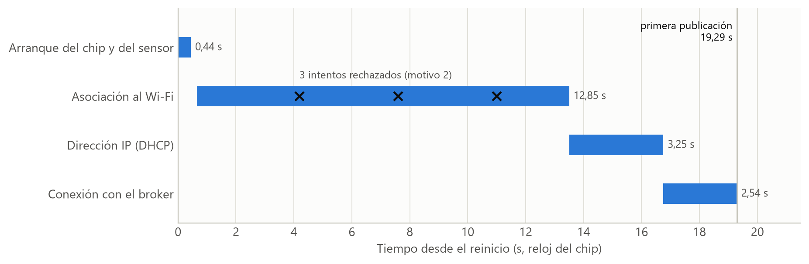
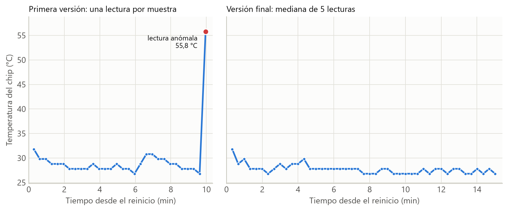
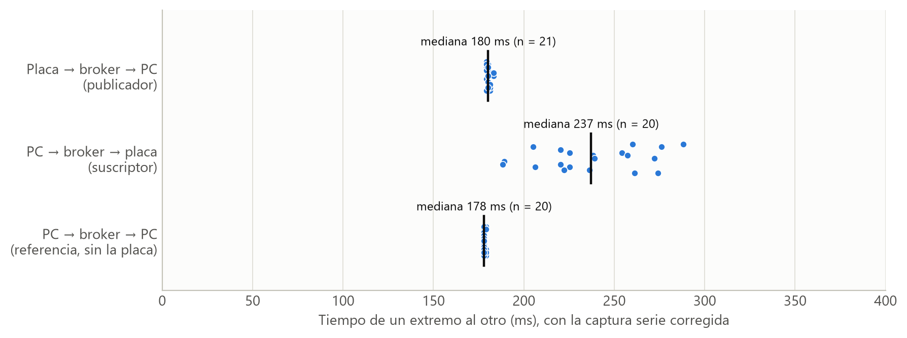
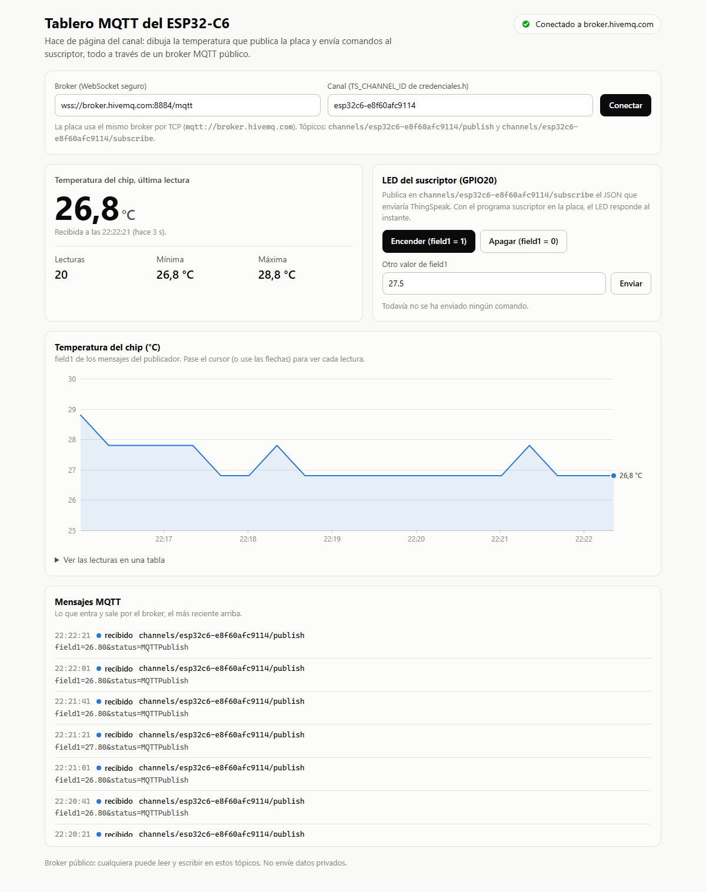
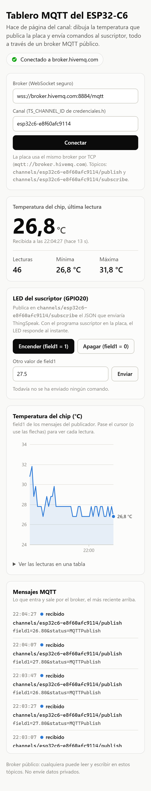
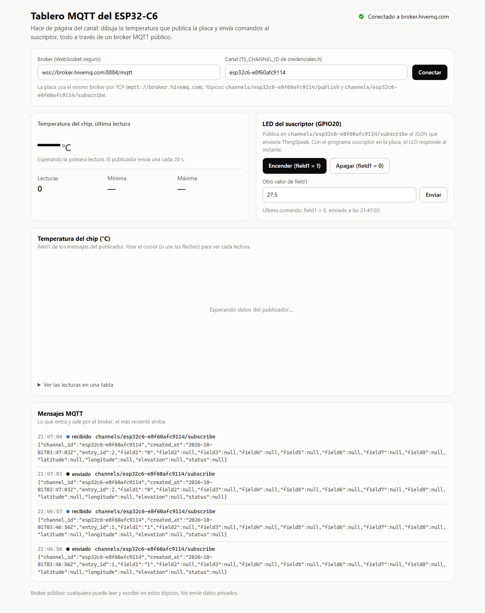
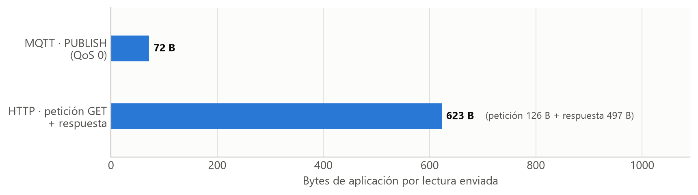

# Informe técnico

## Protocolo ligero para IoT: MQTT con el ESP32‑C6

**Práctica:** publicar por MQTT la temperatura que mide un sensor compatible con el ESP32‑C6, con el SDK oficial ESP‑IDF y su cliente `esp-mqtt`, y recibir en la placa, como suscriptor, los datos de un canal en el momento en que cambian. El enunciado usa ThingSpeak como broker. No fue posible crear la cuenta de MathWorks que exige, así que la práctica se hizo con un broker MQTT público y un tablero web que hace el papel de la página del canal (sección 4.3).

**Código y datos:** ver el `README.md` de esta carpeta, en el repositorio [github.com/Imxnxl/InternetOfThings](https://github.com/Imxnxl/InternetOfThings).

---

## 1. Objetivo

- Publicar desde el ESP32‑C6, con el cliente MQTT oficial de ESP‑IDF, la temperatura de un sensor compatible con la placa (punto 2.1 del enunciado).
- Recibir en el ESP32‑C6, como suscriptor, cada dato nuevo del canal en el momento en que se publica, sin consultas periódicas, y actuar con él sobre un LED.
- Medir en la placa lo que el enunciado afirma en prosa: cuánto tarda en conectarse, con qué regularidad publica, cuánto tarda un mensaje en cruzar el broker y cuántos bytes cuesta cada lectura frente a HTTP.

---

## 2. Fundamento

### 2.1 Publicador, suscriptor y broker

En el modelo publicador/suscriptor los dispositivos no se comunican entre sí: todos hablan con un intermediario, el **broker**. Quien produce un dato lo **publica** en un **tópico**, una ruta de texto como `channels/<canal>/publish`. Quien lo necesita se **suscribe** a ese tópico, y el broker le reenvía cada mensaje en cuanto llega. Ninguno de los dos sabe quién está al otro lado: solo comparten el nombre del tópico.


### 2.2 Los tópicos de ThingSpeak

ThingSpeak expone cada canal con dos tópicos, y cada uno usa un formato de mensaje distinto:

| Tópico | Quién publica | Formato del mensaje |
|---|---|---|
| `channels/<ID>/publish` | El dispositivo | Formulario URL: `field1=31.80&status=MQTTPublish` |
| `channels/<ID>/subscribe` | ThingSpeak, cada vez que el canal recibe un dato | La entrada del canal en JSON: `{"field1":"31.80", …}` |

Además de los campos, el JSON de una entrada lleva el canal, la fecha, el número de entrada, la posición y el estado. Por ejemplo (valores ilustrativos):

```
{"channel_id":3012345,"created_at":"2026-09-30T21:10:28Z","entry_id":7,"field1":"31.80",
 "field2":null, … ,"latitude":null,"longitude":null,"elevation":null,"status":null}
```

La asimetría importa: el suscriptor del enunciado compara el mensaje recibido con el texto `field1=1`, que es el formato de *publicación*, y por eso su acción no se ejecutaría nunca (sección 4.2). El formato JSON no pudo comprobarse contra ThingSpeak por falta de cuenta; es el que reproduce el tablero de esta práctica.

### 2.3 Calidad de servicio, sesión y keep‑alive

- **QoS 0, «como mucho una vez».** El mensaje se envía una vez, sin acuse de recibo. Es el único nivel que admite ThingSpeak. Por eso `esp_mqtt_client_publish()` devuelve 0 en lugar de un identificador de mensaje: no hay confirmación que esperar.
- **Conexión persistente.** El cliente abre una conexión TCP y la mantiene. Si pasan 120 s sin tráfico (el *keep‑alive* por defecto de `esp-mqtt` 1.1.0), envía un `PINGREQ` de 2 bytes y el broker contesta con un `PINGRESP` de 2 bytes.
- **Sesión limpia.** Al desconectarse un cliente, el broker olvida sus suscripciones. Por eso el suscriptor se suscribe en cada `MQTT_EVENT_CONNECTED` y no una sola vez al arrancar: si la conexión cae, `esp-mqtt` reconecta a los 10 s y la suscripción se renueva sola.

### 2.4 MQTT frente a HTTP

Con HTTP, cada lectura es una petición completa (línea de petición y cabeceras en texto) más una respuesta, a menudo por una conexión que se abre y se cierra en cada envío. Con MQTT, la conexión ya está abierta y una lectura es un único paquete `PUBLISH`, con 2 bytes de cabecera fija. La sección 5.6 mide la diferencia con la misma lectura.

### 2.5 El sensor de temperatura del ESP32‑C6

El ESP32‑C6 integra un sensor de temperatura: un ADC sigma‑delta de 8 bits con un DAC que compensa la medida. En ESP‑IDF se usa con el driver `temperature_sensor` (componente `esp_driver_tsens`). Tiene cinco escalas, y el driver elige la de menor error que cubra el rango pedido (tabla del propio driver, `esp_hal_ana_conv/esp32c6/temperature_sensor_periph.c`):

| Escala | Error máximo |
|---|---|
| 50 … 125 °C | 3 °C |
| 20 … 100 °C | 2 °C |
| **−10 … 80 °C** | **1 °C (la usada)** |
| −30 … 50 °C | 2 °C |
| −40 … 20 °C | 3 °C |

Espressif advierte que el sensor mide la temperatura **del silicio**, no la del ambiente: refleja bien los cambios, pero marca más que un termómetro y depende de la actividad del chip. Aun así, es el sensor de temperatura que trae cualquier ESP32‑C6, sin cableado, y basta para el objetivo de la práctica, que es transportar la medida por MQTT.

---

## 3. Materiales

| Material | Cantidad | Nota |
|---|---|---|
| Placa de desarrollo ESP32‑C6 | 1 | Modelo de Muse Lab, compatible con la ESP32‑C6‑DevKitC‑1; chip rev. v0.2 y 16 MB de flash |
| Cable USB‑C | 1 | Al conector «UART» (CH343) de la placa, COM5 |
| Red Wi‑Fi de 2,4 GHz con WPA2 | — | El ESP32‑C6 no usa la banda de 5 GHz |
| Módulo LED RGB de 4 pines | 1 | Opcional: canal G en GPIO20, para ver la acción del suscriptor |
| PC con Windows 11 | 1 | ESP‑IDF v6.1, Node.js 24 y Microsoft Edge |
| Broker MQTT público `broker.hivemq.com` | — | Sin cuenta. TCP 1883 para la placa y WebSocket seguro 8884 para el tablero |

---

## 4. Desarrollo

### 4.1 Entorno: ESP‑IDF v6.1 y el componente MQTT

La documentación «stable» que cita el enunciado corresponde a ESP‑IDF **v6.1**. Se instaló en `C:\esp\v6.1\esp-idf` con `install.ps1 esp32c6`. Desde la versión 6.0, el cliente MQTT ya no forma parte de ESP‑IDF: es un componente del registro de Espressif. Por eso el enunciado pide agregarlo «con las instrucciones de la documentación»:

```
idf.py add-dependency espressif/mqtt
```

El comando crea `main/idf_component.yml`. Al compilar, el gestor de componentes descarga `espressif/mqtt` 1.1.0 y fija esa versión en `dependencies.lock`. La otra instrucción del enunciado, la del `CMakeLists.txt` raíz, añade el componente de los ejemplos que conecta el Wi‑Fi con `example_connect()`:

```cmake
set(EXTRA_COMPONENT_DIRS $ENV{IDF_PATH}/examples/common_components/protocol_examples_common)
```

Los dos programas, `firmware/publicador` y `firmware/suscriptor`, son proyectos ESP‑IDF independientes, como en el enunciado, donde el suscriptor «reemplaza el archivo main.c». Comparten un único archivo de credenciales: `firmware/credenciales.h`.

### 4.2 Correcciones al código del enunciado

El texto del enunciado parece copiado de la respuesta de un asistente de IA (de ahí el «Usa el código con precaución» y las preguntas del final), y al copiarlo se perdieron las direcciones web. Tal como está, el código no compila y, una vez corregido, el suscriptor no ejecutaría nunca su acción:

| En el enunciado | Problema | Corrección |
|---|---|---|
| `TS_BROKER_URI "mqtt://://thingspeak.com"` | Falta el nombre del servidor | `mqtt://mqtt3.thingspeak.com`, o el broker que indique `credenciales.h` |
| `case MQTT_EVENT_SUBCRIBED:` | Errata: no compila | `MQTT_EVENT_SUBSCRIBED` |
| `strncmp(event->data, "field1=1", 8)` | El mensaje de `subscribe` es JSON, no `field1=1` | Se busca el valor de `"field1"` dentro del JSON |
| URL de prueba `https://thingspeak.com` | Faltan la ruta y la clave | La URL completa, debajo de la tabla |
| Publica un 25 fijo, una sola vez | El punto 2.1 pide un sensor de temperatura | Sensor integrado, leído y publicado cada 20 s |
| Tabla de particiones por defecto | El programa ocupa 1,06 MB y no cabe en la partición de 1 MB | Partición «large», de 1,5 MB, en `sdkconfig.defaults` |

La URL de prueba completa es `https://api.thingspeak.com/update?api_key=<WRITE_API_KEY>&field1=1`, y la opción de la partición, `CONFIG_PARTITION_TABLE_SINGLE_APP_LARGE=y`.

### 4.3 Por qué un broker público y no ThingSpeak

ThingSpeak exige una cuenta de MathWorks para crear el canal y las credenciales MQTT del dispositivo. No fue posible iniciar sesión, recuperar la contraseña ni crear una cuenta nueva. La página de estado de MathWorks no mostraba ninguna incidencia ese día (30 de septiembre de 2026), así que el problema estaba del lado del navegador o de la cuenta, y no se resolvió a tiempo.

Para no depender de la cuenta sin cambiar la práctica:

1. **El firmware es el mismo.** El broker se elige en `credenciales.h` (`TS_BROKER_URI`), y por defecto sigue siendo `mqtt3.thingspeak.com`. Con `credenciales.broker_publico.h`, la placa usa `broker.hivemq.com`, un broker público que no pide usuario ni contraseña.
2. **Los tópicos y los formatos son los de ThingSpeak.** El publicador sigue enviando `field1=…` a `channels/<canal>/publish`, y el suscriptor sigue esperando el JSON del canal en `channels/<canal>/subscribe`.
3. **El tablero web hace lo que haría ThingSpeak:** dibuja lo que llega a `.../publish` y publica en `.../subscribe` el JSON del canal (sección 4.6).

Pasar a ThingSpeak cuando haya cuenta consiste en rellenar `credenciales.ejemplo.h`, copiarlo como `credenciales.h` y volver a compilar.

Lo que se pierde respecto a ThingSpeak: el broker público **no guarda** los datos (el tablero los conserva solo mientras está abierto, y permite descargarlos en CSV), **no autentica** a nadie y **cualquiera** puede leer o escribir en cualquier tópico. La sección 6 analiza qué implica.

### 4.4 Publicador

El núcleo del programa (completo en el Anexo A) es una tarea de FreeRTOS:

```c
static void tarea_publicar(void *arg)
{
    for (;;) {
        // Bloqueada, sin gastar CPU, hasta que haya conexion con el broker
        xEventGroupWaitBits(eventos_mqtt, BIT_CONECTADO, pdFALSE, pdTRUE, portMAX_DELAY);
        publicar_temperatura();      // lee el sensor y publica field1=<temperatura>
        vTaskDelay(pdMS_TO_TICKS(PERIODO_PUBLICACION_MS));      // 20 s
    }
}
```

Decisiones de diseño:

- **1. Sensor integrado, escala de −10 a 80 °C.** Es la de menor error (1 °C). La primera lectura se hace antes de encender el Wi‑Fi, para comprobar que el sensor responde.
- **2. Publicar cada 20 s desde una tarea, no desde el evento de conexión.** El enunciado publica una sola vez, en `MQTT_EVENT_CONNECTED`. Para un sensor hace falta publicar periódicamente, y un canal gratuito de ThingSpeak admite como máximo una actualización cada 15 s: 20 s deja margen. La tarea espera un bit que pone `MQTT_EVENT_CONNECTED` y quita `MQTT_EVENT_DISCONNECTED`. Así no publica sin conexión, y la primera lectura sale en el mismo instante en que se conecta.
- **3. QoS 0 y sin retención**, que es lo que exige ThingSpeak.
- **4. Los errores se explican.** Ante un `MQTT_EVENT_ERROR`, el programa indica si el broker rechazó la conexión (y con qué código) o si falló el transporte, y en ese caso nombra la causa (por ejemplo, `ESP_ERR_ESP_TLS_CANNOT_RESOLVE_HOSTNAME` si falló el DNS). Si el Wi‑Fi no conecta, lo dice y reinicia la placa a los 10 s, en lugar de detenerse con un `ESP_ERROR_CHECK`.
- **5. Cada muestra es la mediana de 5 lecturas.** Se añadió después de la primera prueba larga, en la que una lectura salió casi 28 °C desviada (sección 5.2). Las 5 lecturas, separadas 10 ms, tardan unos 40 ms; la mediana descarta una lectura aislada errónea, y las que se alejan más de 5 °C de la mediana se avisan por el monitor.

### 4.5 Suscriptor

```c
case MQTT_EVENT_CONNECTED:
    // En cada conexion: con sesion limpia, el broker olvida las suscripciones
    esp_mqtt_client_subscribe(client, "channels/<canal>/subscribe", 0);
    break;

case MQTT_EVENT_DATA:
    printf("Datos recibidos: %.*s\r\n", event->data_len, event->data);
    procesar_mensaje(event->data, event->data_len);   // "field1":"1" -> LED encendido
    break;
```

Decisiones de diseño:

- **1. El mensaje se copia antes de leerlo.** `event->data` no termina en `'\0'`; para poder usar las funciones de texto de C se copia a un buffer de 512 bytes.
- **2. Un intérprete mínimo de JSON.** Busca la clave `"field1":` y lee su valor, entre comillas o sin ellas; `null` significa que esa entrada no trae el campo. No hace falta otra dependencia: en ESP‑IDF 6 también cJSON salió del framework.
- **3. Comando = el número 1 o el número 0.** Se convierte con `strtof`, así que `"1"`, `"1.0"` y `1` encienden. Cualquier otro valor no cambia el LED. En un broker público cualquiera puede publicar en el tópico, así que el mensaje se trata como entrada no confiable.
- **4. Se comprueba la respuesta a la suscripción.** Si el broker la rechaza (código `0x80`), el programa lo dice. En ThingSpeak es lo que ocurre cuando el dispositivo MQTT no tiene el permiso *Allow Subscribe*.
- **5. LED en GPIO20 con la fuerza de salida mínima** (~5 mA), igual que en las prácticas anteriores, por si el módulo no lleva resistencia.
- **6. El ahorro de energía del Wi‑Fi se puede desactivar.** Con `WIFI_SIEMPRE_ENCENDIDO = 1`, la radio no duerme entre balizas del router. Por defecto vale 0, el modo de ESP‑IDF; la sección 5.4 mide lo que cuesta en latencia.

### 4.6 Tablero web

`tablero/tablero.html` es un único archivo HTML que se abre con doble clic. Usa MQTT.js 5.16 sobre WebSocket seguro (`wss://broker.hivemq.com:8884/mqtt`) y se suscribe a los dos tópicos del canal:

- De `.../publish` toma `field1` y lo dibuja: última lectura, mínima, máxima, gráfica con cursor y tabla descargable en CSV.
- Sus botones publican en `.../subscribe` el JSON del canal con `field1 = 1` o `0`, igual que lo haría ThingSpeak.
- Muestra un registro de todo lo que entra y sale por el broker.

Todo lo que llega del broker se inserta como texto, nunca como HTML, porque en un broker público cualquiera puede publicar.

### 4.7 Credenciales fuera del repositorio

El repositorio es público. El SSID y la contraseña del Wi‑Fi se guardan en `sdkconfig` (con `idf.py menuconfig`) y las credenciales de ThingSpeak en `firmware/credenciales.h`; los dos archivos están en `.gitignore`. En el repositorio solo hay plantillas: `sdkconfig.defaults`, `credenciales.ejemplo.h` y `credenciales.broker_publico.h`, que no tiene secretos. En los registros de `docs/evidencias/` se ocultaron el nombre de la red y el BSSID (la MAC) del router, porque el BSSID basta para ubicar un router en las bases de datos de geolocalización Wi‑Fi.

### 4.8 Compilación

| Programa | Imagen | RAM estática (DIRAM) | Partición de 1,5 MB |
|---|---|---|---|
| Publicador | 1 063 136 B | 140 445 B (31,1 %) | 69 % ocupada |
| Suscriptor | 1 064 656 B | 140 159 B (31,0 %) | 69 % ocupada |

Entorno: ESP‑IDF v6.1, `espressif/mqtt` 1.1.0, picolibc, FreeRTOS a 100 Hz y CPU a 160 MHz. Compilación sin avisos.

¿Por qué ocupa 1 MB un programa tan corto? Según `idf.py size-components`, el código propio (`libmain.a`) ocupa **1 409 bytes**, y el cliente MQTT 16 KB, más 11 KB del transporte TCP. El resto es la pila Wi‑Fi (`net80211`, `pp`, `wpa_supplicant`, `phy`: unos 440 KB), la criptografía (unos 175 KB), lwIP (127 KB) y la biblioteca de E/S estándar. De ahí que no quepa en la partición de 1 MB por defecto.

---

## 5. Pruebas y resultados

Todas las pruebas se hicieron en la placa, con el broker público, el 30 de septiembre y el 1 de octubre de 2026. Se usaron dos herramientas que sellan cada línea con el **mismo reloj, el del PC**, de modo que sus tiempos se pueden restar:

- `scripts/capturar_monitor.py` guarda la salida serie de la placa;
- `scripts/cliente_mqtt.js` es otro cliente MQTT en el PC: escucha el canal o envía comandos.

| Prueba | Duración | Registros (`docs/evidencias/`) |
|---|---|---|
| Publicador, primera versión | 10 min, 30 publicaciones | `monitor_publicador_v1.txt`, `pc_publicador_v1.txt` |
| Publicador, versión final | 15 min, 45 publicaciones | `monitor_publicador.txt`, `pc_publicador.txt` |
| Publicador, latencia con la captura corregida | 7 min, 21 publicaciones | `monitor_publicador_latencia.txt`, `pc_publicador_latencia.txt` |
| Suscriptor, 26 comandos con casos límite | 3 min | `monitor_suscriptor.txt`, `pc_suscriptor.txt` |
| Suscriptor con la radio siempre encendida | 2 min, 20 comandos | `monitor_suscriptor_sin_ahorro.txt`, `pc_suscriptor_sin_ahorro.txt` |
| Suscriptor, latencia con la captura corregida | 2 min, 20 comandos | `monitor_suscriptor_latencia.txt`, `pc_suscriptor_latencia.txt`, `pc_observador_latencia.txt` |
| Wi‑Fi mal configurado | 30 s | `monitor_publicador_sin_wifi.txt` |
| La misma lectura enviada por HTTP | 1 petición | `peticion_http.txt` |

### 5.1 Del reinicio a la primera publicación

Arranque de la versión final, con los tiempos del reloj del chip (milisegundos desde el reinicio):

```
I (442) MQTT_THINGSPEAK: Sensor de temperatura listo: 27.80 C (Wi-Fi apagado)
I (652) example_connect: Connecting to <SSID>...
I (4192) example_connect: Wi-Fi disconnected 2, trying to reconnect...
I (7602) example_connect: Wi-Fi disconnected 2, trying to reconnect...
I (11012) example_connect: Wi-Fi disconnected 2, trying to reconnect...
I (13502) wifi:connected with <SSID>, aid = 109, channel 5, BW20, bssid = <BSSID>
I (16752) example_connect: Got IPv4 event: Interface "example_netif_sta" address: 192.168.1.191
I (16762) MQTT_THINGSPEAK: Broker: mqtt://broker.hivemq.com | canal: esp32c6-e8f60afc9114
I (19292) MQTT_THINGSPEAK: Conectado exitosamente al Broker
I (19332) MQTT_THINGSPEAK: Temperatura 31.80 C -> channels/esp32c6-e8f60afc9114/publish: field1=31.80&status=MQTTPublish (ID 0)
```



**Lectura.** La primera publicación sale a los **19,3 s** (17,3 s en otras dos pruebas). Casi todo ese tiempo es Wi‑Fi: en todas las pruebas, el router rechazó entre uno y cinco intentos de asociación con el motivo 2 (`WIFI_REASON_AUTH_EXPIRE`, «la autenticación caducó») antes de aceptar uno. `example_connect()` reintenta solo, hasta 6 veces. La dirección IP tarda otros 3,25 s, y la conexión con el broker, entre 0,5 y 2,5 s. El sensor, en cambio, está listo a los 0,44 s.

### 5.2 Publicaciones durante 10 y 15 minutos



| | Primera versión | Versión final |
|---|---|---|
| Duración | 10 min | 15 min |
| Publicaciones de la placa recibidas en el PC | 30 de 30 | 45 de 45 |
| Periodo según el reloj del chip | 20 000 ms, siempre | 20 040 ms, siempre |
| Temperatura | 26,8 … 31,8 °C, y una de **55,8 °C** | 26,8 … 31,8 °C |
| Lecturas anómalas | 1 de 30 | 0 de 225 (45 × 5) |

**Lectura.**

- **Ninguna publicación se perdió**, y el periodo fue exacto según el reloj del chip.
- **El sensor tiene una resolución de 1 °C.** Todos los valores terminan en ,8: la capa HAL del driver calcula grados **enteros** y después el driver les resta la calibración de fábrica que el chip guarda en su eFuse, que en esta placa es de 0,2 °C.
- **El Wi‑Fi calienta el chip.** Antes de encender la radio, el sensor marcó entre 27,8 y 30,8 °C según la prueba. Al terminar la conexión, con sus reintentos, subió a 30,8–31,8 °C, y unos minutos después bajó a 26,8–27,8 °C, con la radio ya casi siempre dormida.
- **La lectura de 55,8 °C es un error del sensor, no del chip.** Llegó entre una de 26,8 y otra de 31,8 °C, separadas por 20 s; el silicio no puede calentarse 29 °C y enfriarse en ese tiempo. El salto coincide, dentro de la resolución de 1 °C, con **un escalón del DAC del sensor: 27,88 °C**. El driver convierte con `T = 0,4386·raw − 27,88·desfase − 20,52`, usando el desfase que tiene anotado. La biblioteca de la radio Wi‑Fi (`libphy`, de código cerrado) lee el mismo sensor para calibrarse (contiene `tsens_read_init_new` y `tsens_temp_read_new`). Si cambia la escala del sensor justo cuando lee el driver, la conversión usa un desfase equivocado. Es la causa más probable; no se puede confirmar sin el código de `libphy`.
- **La corrección no tuvo que actuar.** Con la mediana de 5 lecturas, la versión final tomó 225 lecturas sin ninguna anómala. La prueba demuestra que el filtro no altera las lecturas normales; no llegó a ver una lectura errónea que descartar. Una anomalía en 30 lecturas y ninguna en 225 indican que el fallo es raro.
- **El periodo pasó de 20 000 a 20 040 ms** porque `vTaskDelay()` empieza a contar al terminar la publicación, y las 5 lecturas añaden 4 pausas de 10 ms. Con `xTaskDelayUntil()` el periodo sería exacto. Para esta aplicación da igual: ThingSpeak solo exige 15 s entre datos.

### 5.3 Suscriptor: comandos y casos límite

El PC envió 26 mensajes al tópico del suscriptor, en el formato JSON del canal, y después se pulsaron los dos botones del tablero:

| `field1` enviado | Mensajes | Recibidos | Acción en la placa |
|---|---|---|---|
| `1` y `0`, alternados cada 4 s | 20 | 14 | LED encendido o apagado según el valor, las 14 veces |
| `27.5` | 1 | 1 | «no es un comando (1 o 0): el LED no cambia» |
| `1.0` | 1 | 1 | LED encendido: 1,0 es el número 1 |
| `abc` | 1 | 1 | «no es un comando (1 o 0): el LED no cambia» |
| `null` | 1 | 1 | «Esta entrada no trae field1: no hay accion» |
| `hola`, sin JSON | 1 | 1 | «Esta entrada no trae field1: no hay accion» |
| `0` | 1 | 1 | LED apagado |
| Botones del tablero: `1` y `0` | 2 | 2 | LED encendido y apagado |

Así se ve en la placa la llegada de un comando:

```
I (47083) MQTT_SUB_THINGSPEAK: NOTIFICACION RECIBIDA!
Topico: channels/esp32c6-e8f60afc9114/subscribe
Datos recibidos: {"channel_id":"esp32c6-e8f60afc9114","created_at":"2026-10-01T03:45:24Z","entry_id":7,"field1":"1",
                  "field2":null, … ,"status":null}
I (47103) MQTT_SUB_THINGSPEAK: Accion: Comando de encendido detectado (field1=1) -> LED encendido
```

Los 6 mensajes que no llegaron fueron los primeros. La placa tenía dirección IP a los 23,8 s, pero la primera consulta DNS del nombre del broker falló:

```
E (30673) esp-tls: couldn't get hostname for :broker.hivemq.com: getaddrinfo() returns 202, addrinfo=0
E (30673) transport_base: Failed to open a new connection: 32769
E (30673) mqtt_client: Error transport connect
I (30683) MQTT_SUB_THINGSPEAK: Desconectado del Broker.
I (46163) MQTT_SUB_THINGSPEAK: Conectado al Broker. Suscribiendose al canal...
I (46363) MQTT_SUB_THINGSPEAK: Suscripcion confirmada por el Broker. Esperando datos...
```

**Lectura.** El cliente se recuperó solo: `esp-mqtt` reintentó a los 10 s, conectó y, como la suscripción se hace en cada `MQTT_EVENT_CONNECTED`, volvió a suscribirse sin intervención. Pero los 6 comandos publicados mientras la placa no estaba suscrita **se perdieron**, y el broker no avisó a nadie: con QoS 0 y sesión limpia, el broker no guarda mensajes para un cliente que no está suscrito (sección 2.3). Con ThingSpeak, que solo admite QoS 0, ocurriría lo mismo.

Todos los mensajes que sí llegaron se interpretaron bien, incluidos los que no son comandos. La acción sobre el LED se comprobó en el registro de la placa; la comprobación visual, con el módulo conectado a GPIO20, queda para la revisión presencial.

### 5.4 Cuánto tarda un mensaje en cruzar el broker

**Primera medición, sesgada.** Con los registros de 5.2 y 5.3, la mediana salía de **76 ms** de la placa al PC y de **385 ms** del PC a la placa. Dos cosas no cuadraban:

1. El nombre `broker.hivemq.com` resuelve a dos servidores de Amazon en Fráncfort (Alemania), y abrir una conexión TCP con él desde este PC tarda unos 200 ms (ida y vuelta). Un mensaje de la placa al PC hace al menos ese mismo viaje, así que **76 ms es imposible**.
2. La diferencia entre los dos sentidos era demasiado grande. Desactivar el ahorro de energía del Wi‑Fi, la explicación natural, solo la redujo en 44 ms: de 385 a 341 ms.

La causa estaba en la herramienta de medida. `capturar_monitor.py` leía el puerto con `s.read(2048)` y un *timeout* de 0,1 s. En Windows, esa lectura espera a llenar los 2048 bytes o a que se agote el tiempo, así que cada línea de la placa se sellaba **entre 100 y 150 ms tarde**. Ese retraso restaba en la medida del publicador (la línea de la placa llegaba tarde) y sumaba en la del suscriptor. Se corrigió para leer lo que ya ha llegado (`s.read(max(1, s.in_waiting))`) y se repitió la medición en los dos sentidos, más una referencia que no pasa por la placa: los mismos comandos recibidos por otro cliente en el PC.



| Trayecto | Mediana | Mínimo … máximo | Mensajes |
|---|---|---|---|
| Placa → broker → PC (publicador) | **180 ms** | 179 … 183 ms | 21 |
| PC → broker → PC (referencia) | **178 ms** | 178 … 179 ms | 20 |
| PC → broker → placa (suscriptor) | **237 ms** | 188 … 288 ms | 20 |

**Lectura.**

- **La latencia la pone la distancia al broker.** Los ~180 ms son el viaje de ida y vuelta a Fráncfort: un mensaje de la placa llega al PC solo 2 ms más tarde que uno del propio PC. El Wi‑Fi de subida apenas suma.
- **De bajada, la placa añade unos 60 ms, repartidos en unos 100 ms.** Es el ahorro de energía del Wi‑Fi, activo por defecto (`WIFI_PS_MIN_MODEM`): la radio duerme entre las balizas del router (normalmente, una cada 102,4 ms), y el router guarda los mensajes para la placa hasta la siguiente baliza. La espera va de 0 a ~100 ms y la media ronda la mitad. Con la radio siempre encendida, la mediana bajó 44 ms, que concuerda. Es el precio de gastar menos energía, y para encender un LED es imperceptible.
- **Los mensajes no se pierden por la red, pero a veces se retrasan.** En las pruebas largas se retrasaron 6 de las 75 publicaciones: cinco tardaron entre 2,6 y 4 s, y una, 10,5 s. Un retraso de ~3 s es el tiempo de retransmisión inicial de TCP en lwIP: se perdió una trama Wi‑Fi y TCP la reenvió. Con la conexión viva, QoS 0 no pierde mensajes por la red, porque TCP ya los reenvía; los pierde cuando la conexión se cae (sección 5.3).

### 5.5 Tablero web







| # | Prueba | Resultado |
|---|---|---|
| T1 | Recibir las publicaciones de la placa | **Cumple.** Recibió y dibujó todas las lecturas, igual que el cliente MQTT del PC |
| T2 | Encender y apagar el LED con los botones | **Cumple.** La placa recibió los dos comandos y los ejecutó (líneas `I (141423)` e `I (146833)` de `monitor_suscriptor.txt`) |
| T3 | Móvil de 390 px | **Cumple.** Una columna, sin desplazamiento horizontal |
| T4 | Cursor y teclado sobre la gráfica | **Cumple.** El tooltip muestra hora y valor; las flechas recorren las lecturas |
| T5 | Errores en la consola del navegador | **Cumple.** Ninguno |

En una prueba de 15 minutos con la pestaña del tablero oculta detrás de otra, Edge la congeló al final y cortó su conexión. Con la pestaña visible no ocurre; si pasa, basta con pulsar «Conectar».

### 5.6 MQTT frente a HTTP: bytes por lectura

Para comparar con la misma lectura, se envió a la API HTTP de ThingSpeak la petición equivalente (`GET /update?api_key=…&field1=29.80`) y se midió con `curl`. El paquete MQTT se calcula a partir del formato del protocolo.



| | MQTT | HTTP |
|---|---|---|
| Lo que viaja | Un `PUBLISH`: 1 B de tipo, 1 B de longitud, 2 B de longitud del tópico, el tópico (37 B) y el mensaje (31 B) | Línea de petición con la clave y el dato, y 3 cabeceras |
| Bytes por lectura | **72 B** | **623 B**: 126 B de petición y 497 B de respuesta |
| Respuesta | Ninguna (QoS 0) | Línea de estado, 13 cabeceras y el cuerpo |
| Conexión | Abierta una sola vez; si no hay tráfico, `PINGREQ` y `PINGRESP` de 2 B cada 120 s | Una conexión TCP por petición si no se reutiliza (0,11 s en abrirla); con HTTPS, además, la negociación TLS |

**Lectura.** MQTT usa el **11,6 %** de los bytes de HTTP: 8,7 veces menos. Con el tópico de un canal de ThingSpeak (un número de 7 cifras), el paquete baja a 59 B. A una lectura cada 20 s, en un día son 311 KB con MQTT frente a 2,7 MB con HTTP, sin contar las cabeceras TCP/IP ni el establecimiento de las conexiones. Además, con HTTP la placa tendría que preguntar periódicamente para recibir comandos; con MQTT le llegan solos.

### 5.7 Wi‑Fi mal configurado

Con el SSID de ejemplo (`myssid`), que no existe:

```
I (3081) example_connect: Wi-Fi disconnected 201, trying to reconnect...
   ... (otros 5 intentos) ...
I (17521) example_connect: WiFi Connect failed 7 times, stop reconnect.
E (17521) MQTT_THINGSPEAK: No se pudo conectar al Wi-Fi. Revise el SSID y la contrasena en idf.py menuconfig
          -> Example Connection Configuration (solo redes de 2,4 GHz). Reinicio en 10 s...
rst:0xc (SW_CPU),boot:0x3c (SPI_FAST_FLASH_BOOT)
```

**Lectura.** El motivo 201 es `WIFI_REASON_NO_AP_FOUND`: no encuentra la red. Tras 7 intentos, el programa explica qué revisar y reinicia la placa a los 10 s, en lugar de detenerse con el `ESP_ERROR_CHECK` del enunciado.

---

## 6. Análisis

**Lo que aporta MQTT.** La conexión se abre una vez y cada lectura cuesta 72 bytes. Los comandos llegan a la placa en ~0,24 s sin que ella pregunte nada. Con HTTP, para reaccionar igual de rápido, la placa tendría que consultar al servidor varias veces por segundo, a más de 600 bytes por consulta.

**Lo que hay que saber de QoS 0.** No es «poco fiable» mientras la conexión vive: TCP reenvía lo que se pierde por el aire (5.4). Lo que no hace es guardar nada para un suscriptor desconectado (5.3). Si un comando importa, hay dos salidas habituales: publicar el estado como mensaje retenido, para que el broker se lo entregue a quien se suscriba después, o usar QoS 1 con sesión persistente. ThingSpeak no admite ninguna de las dos.

**El broker público no es seguro.** No pide credenciales, y por el puerto 1883 todo viaja en claro, incluido el nombre del tópico. Cualquiera que lo conozca puede leer la temperatura o encender el LED. En la práctica se mitigó con un nombre de canal único, sin enviar nada privado, y con un suscriptor que solo actúa ante los números 1 y 0. Un sistema real necesita cifrado TLS (`mqtts://`, puerto 8883, que `esp-mqtt` admite con el paquete de certificados de ESP‑IDF), credenciales y permisos por tópico. Es lo que ofrecen los dispositivos MQTT de ThingSpeak.

**El sensor integrado mide el chip.** Su resolución es de 1 °C, marca más que el ambiente y sube con la actividad de la radio. Además, convive con la calibración del Wi‑Fi (5.2). Para medir la temperatura ambiente habría que usar un sensor externo (DHT22, DS18B20…); la parte MQTT no cambiaría, solo la función `leer_temperatura()`.

**La latencia es la distancia.** Los 180 ms son el viaje a Fráncfort. Un broker en la red local (por ejemplo, Mosquitto en el PC) los reduciría a pocos milisegundos; la placa solo añade ~2 ms de subida y ~60 ms de bajada por el ahorro de energía.

**Medir también es parte de la práctica.** La primera medición de latencia dio un resultado físicamente imposible por un detalle de la herramienta (cómo lee el puerto serie). Comprobar la medida contra un límite físico (el tiempo de ida y vuelta al broker) y contra una referencia que no pasa por la placa es lo que permitió detectarlo.

**ThingSpeak frente al broker público.** ThingSpeak guarda los datos, dibuja las gráficas, autentica a cada dispositivo y limita los envíos a uno cada 15 s. El broker público no hace nada de eso: solo reparte mensajes. El firmware está preparado para los dos; con ThingSpeak queda pendiente comprobar el formato JSON de `channels/<ID>/subscribe`, que aquí reproduce el tablero.

---

## 7. Conclusiones

1. **La práctica funciona.** El publicador envía la temperatura del sensor integrado cada 20 s y el suscriptor recibe cada mensaje al momento y actúa sobre el LED. Se hizo con `broker.hivemq.com` porque no se pudo crear la cuenta de MathWorks; el firmware es el mismo, y pasar a ThingSpeak consiste en cambiar `credenciales.h`.
2. **El código del enunciado no funciona tal cual.** Le falta la dirección del broker, `MQTT_EVENT_SUBCRIBED` no compila y la comparación con `"field1=1"` nunca se cumple con el JSON del canal. Además, desde ESP‑IDF 6 el cliente MQTT se añade como componente, y el programa (1,06 MB) no cabe en la partición por defecto.
3. **La primera publicación sale a los 17–19 s del reinicio**, y casi todo ese tiempo es Wi‑Fi: el router rechazó entre uno y cinco intentos antes de aceptar la conexión.
4. **El sensor integrado tiene una resolución de 1 °C y mide el silicio.** En reposo marcó 26,8–31,8 °C. Una de 30 lecturas salió desviada 27,88 °C, un escalón de su DAC, probablemente porque la radio usa el mismo sensor para calibrarse. Con la mediana de 5 lecturas no hubo ninguna anomalía en 225 lecturas.
5. **Un mensaje tarda ~180 ms de la placa al PC y ~237 ms del PC a la placa.** Casi todo es el viaje al broker; el ahorro de energía del Wi‑Fi añade unos 60 ms de bajada (44 ms menos sin él). Las tramas perdidas se recuperan con retransmisiones TCP de ~3 s, sin perder el mensaje.
6. **Con QoS 0, lo que se publica mientras el suscriptor está desconectado se pierde:** 6 de 26 mensajes, durante un fallo de DNS del que el cliente se recuperó solo.
7. **MQTT gasta 72 bytes por lectura frente a 623 de HTTP**, el 11,6 %.
8. **La herramienta de medida también se verifica.** La primera medición de latencia tenía un sesgo de 100–150 ms causado por la captura serie. Se detectó porque daba un valor imposible, y la medida corregida coincide con una referencia independiente.

---

## 8. Reproducibilidad

```powershell
# Entorno de ESP-IDF (en cada terminal nueva)
. C:\esp\v6.1\esp-idf\export.ps1

# Firmware (Wi-Fi con "idf.py menuconfig" en cada proyecto)
copy firmware\credenciales.broker_publico.h firmware\credenciales.h
cd firmware\publicador ; idf.py -p COM5 build flash monitor
cd firmware\suscriptor ; idf.py -p COM5 build flash monitor

# Tablero: abrir tablero\tablero.html con doble clic

# Registros (desde esta carpeta; la placa ya grabada)
python scripts\capturar_monitor.py COM5 900 docs\evidencias\monitor_publicador.txt
cd scripts ; npm install
node cliente_mqtt.js observar 900 ..\docs\evidencias\pc_publicador.txt
node cliente_mqtt.js secuencia "55:1,58:0,61:1" ..\docs\evidencias\pc_suscriptor_latencia.txt

# Figuras y versión Word de este informe (desde esta carpeta)
python scripts\generar_figuras.py
python scripts\graficas_placa.py
cd scripts ; node informe_a_docx.js
```

---

## Anexo A — Código fuente del publicador

Fichero `firmware/publicador/main/main.c`.

<!-- incluir: ../firmware/publicador/main/main.c -->

## Anexo B — Código fuente del suscriptor

Fichero `firmware/suscriptor/main/main.c`.

<!-- incluir: ../firmware/suscriptor/main/main.c -->

## Anexo C — Configuración de los proyectos

`firmware/publicador/CMakeLists.txt` (el del suscriptor es igual, salvo el nombre del proyecto):

<!-- incluir: ../firmware/publicador/CMakeLists.txt -->

`firmware/publicador/sdkconfig.defaults` (igual en los dos proyectos):

<!-- incluir: ../firmware/publicador/sdkconfig.defaults -->

`firmware/publicador/main/idf_component.yml`, creado por `idf.py add-dependency espressif/mqtt`:

<!-- incluir: ../firmware/publicador/main/idf_component.yml -->

`firmware/credenciales.broker_publico.h`:

<!-- incluir: ../firmware/credenciales.broker_publico.h -->

## Anexo D — Fuentes

| Documento | Uso en este informe |
|---|---|
| Espressif, *ESP-IDF Programming Guide* v6.1: ESP-MQTT | El componente MQTT sale de ESP‑IDF en la v6.0 y se añade con `idf.py add-dependency` |
| Espressif, *ESP-IDF Programming Guide* v6.1: Temperature Sensor | El sensor mide el silicio, no el ambiente |
| Código fuente de ESP‑IDF v6.1 (`esp_driver_tsens`, `esp_hal_ana_conv`, `protocol_examples_common`) | Escalas y errores del sensor, fórmula de conversión, reintentos del Wi‑Fi |
| Código fuente de `espressif/mqtt` 1.1.0 | *Keep‑alive* de 120 s, reconexión a los 10 s, respuesta a la suscripción |
| MathWorks, documentación de ThingSpeak: *MQTT Basics*, *Publish to a Channel Feed*, *Subscribe to a Channel Feed* | Broker, puertos, QoS 0, tópicos y formato de publicación |
| MathWorks, *ThingSpeak Licensing FAQ* y MATLAB Answers 1600624 | Límite de 15 s del plan gratuito; las cuentas gratuitas pueden suscribirse |
| Registros de la placa y del PC (`docs/evidencias/`) | Todas las medidas de la sección 5 |
