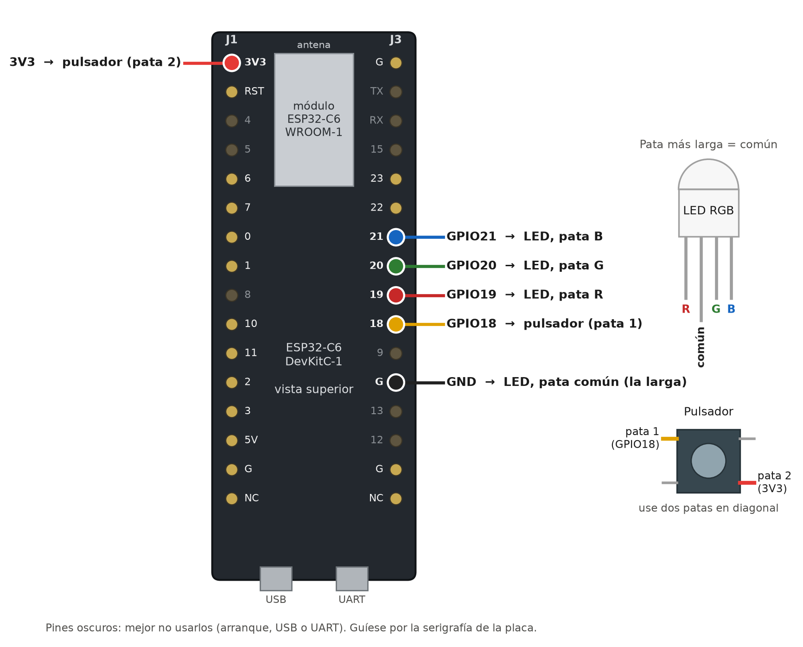
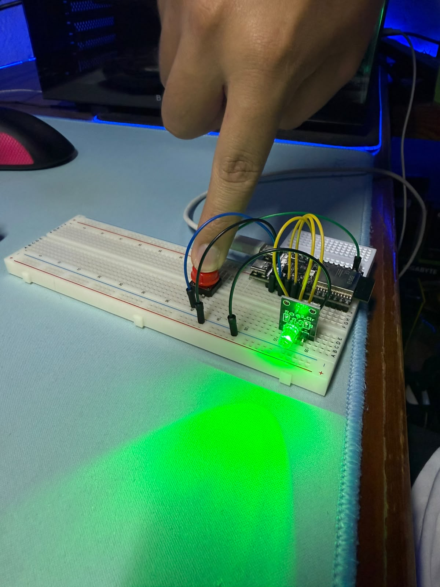

# Pulsador con resistencia pull-down interna — ESP32‑C6

El ejercicio de clase (un pulsador en una entrada digital cuyo estado se envía a
una salida digital que enciende un LED) con un cambio: **no hay resistencia
pull-down física**. Se activa la que el ESP32‑C6 lleva integrada en cada GPIO
(≈45 kΩ):

```cpp
pinMode(PIN_BOTON, INPUT);            // clase: pull-down de 10 kΩ en la protoboard
pinMode(PIN_BOTON, INPUT_PULLDOWN);   // esta práctica: pull-down interno
```

> **[→ Leer el informe técnico](docs/INFORME_TECNICO.md)**
> · También en Word: [`docs/Informe_tecnico_Pulsador_pull-down_interno_ESP32-C6.docx`](docs/Informe_tecnico_Pulsador_pull-down_interno_ESP32-C6.docx)

---

## Conexiones

Materiales: una placa ESP32‑C6, un módulo LED RGB y un pulsador. **Ninguna resistencia.**

| Componente | Pata | Pin de la placa |
|---|---|---|
| Pulsador | pata 1 | **GPIO18** |
| Pulsador | pata 2 | **3V3** (nunca 5V) |
| LED RGB | R | **GPIO19** |
| LED RGB | G | **GPIO20** |
| LED RGB | B | **GPIO21** |
| LED RGB | común (la pata más larga) | **GND** si es de cátodo común · **3V3** si es de ánodo común |



El diagrama muestra la ESP32‑C6‑DevKitC‑1 oficial. La práctica se hizo con un modelo compatible de
Muse Lab, que tiene los pines en otro orden: conecte siempre por el **número de GPIO** serigrafiado.



- Pulsador de 4 patas: use **dos patas en diagonal**.
- LED de **ánodo común**: común a 3V3 y `LED_ANODO_COMUN = true` en el código. Si el LED
  se enciende al soltar y se apaga al pulsar, es que el suyo es de ánodo común.
- Se evitan los pines de arranque (4, 5, 8, 9, 15), los del USB (12, 13) y la UART (16, 17).

---

## Qué hace el programa

1. Lee el pulsador en GPIO18 (`INPUT_PULLDOWN`) y copia su estado en el LED: pulsado → LED
   verde encendido; suelto → apagado.
2. Al arrancar, **lee los registros del chip** e imprime si el pull-down está activado de verdad,
   y enciende rojo, verde y azul por turnos para comprobar el cableado.
3. Por el monitor serie (115200 baudios) informa de cada pulsación, su duración y los rebotes
   del contacto. Enviando `i` repite la cabecera de configuración.
4. Como no hay resistencia para el LED, baja la fuerza de salida de sus pines al nivel mínimo
   (~5 mA). Si consigue resistencias de 220–330 Ω, póngalas.

Salida real en la placa (extracto de `docs/evidencias/monitor_arranque.txt` y `monitor_pulsaciones.txt`):

```
==========================================================
 Pulsador con resistencia pull-down INTERNA - ESP32-C6
 ESP32-C6 rev 2 | 160 MHz | Arduino-ESP32 3.3.11
==========================================================
Entrada  GPIO18  pinMode INPUT_PULLDOWN
         registros del chip -> pull-down: ACTIVADO | pull-up: no | entrada: si
Salidas  GPIO19 (R)  GPIO20 (G)  GPIO21 (B)  LED de catodo comun
         registros del chip -> salida: si | fuerza: nivel 0 de 3
Lectura actual de la entrada: 0  (con el pulsador suelto debe ser 0)
----------------------------------------------------------
Prueba del LED: rojo... verde... azul... ok
Listo. Presione el pulsador.
[   34602 ms] PRESIONADO -> entrada HIGH, LED encendido | pulsacion #1 | cambios leidos: 1
[   34749 ms] SUELTO     -> entrada LOW,  LED apagado   | duracion: 147 ms | cambios leidos: 1
```

En las pruebas se registraron 37 pulsaciones, sin ningún evento espurio en reposo y sin rebotes
detectados (ver la sección 5.2 del informe).

---

## Grabarlo en la placa

Conecte el cable al conector de la placa marcado **«UART»**. En Windows aparece como
*USB-Enhanced-SERIAL CH343 (COMx)*.

> Si prefiere el conector **«USB»**: en Arduino IDE ponga *USB CDC On Boot: Enabled*; en PlatformIO
> cambie `-DARDUINO_USB_CDC_ON_BOOT=0` a `1` en `platformio.ini`. Si no, el programa funciona pero el
> monitor serie no muestra nada.

### Con Arduino IDE

1. Instale el core **«esp32» de Espressif Systems, versión 3.x** (Gestor de placas).
2. Abra `firmware/pulsador_pulldown_interno/pulsador_pulldown_interno.ino`.
3. Herramientas → Placa: **ESP32C6 Dev Module** (deje *USB CDC On Boot: Disabled*, que es lo
   predeterminado) · Puerto: el COM del CH343.
4. Subir y abrir el Monitor Serie a **115200** baudios.

Para el experimento sin pull-down, cambie `USAR_PULLDOWN_INTERNO` a `0` al principio del código.

### Con PlatformIO

```bash
cd firmware
pio run -t upload                  # la práctica (INPUT_PULLDOWN)
pio run -e sin_pulldown -t upload  # experimento: entrada sin pull-down
pio device monitor
```

`platformio.ini` usa la plataforma *pioarduino* (core Arduino 3.x), porque la oficial de
PlatformIO no soporta Arduino en el C6.

**Si falla en Windows con `WindowsLongPathError`:** el core 3.3 trae rutas de más de 260
caracteres. Active las rutas largas de Windows (como administrador, clave
`HKLM\SYSTEM\CurrentControlSet\Control\FileSystem\LongPathsEnabled = 1`) o use un directorio de
PlatformIO con ruta corta: `set PLATFORMIO_CORE_DIR=C:\pio` antes de `pio run`.

---

## Prueba de la lógica en el PC

`pruebas/` compila **el mismo `.ino`** con `g++` contra un Arduino simulado, le aplica una entrada
con pulsaciones limpias, rebotes y un toque demasiado corto, y comprueba que el LED sigue a la
entrada y que el registro serie es correcto. No simula la electrónica: eso se prueba en la placa.

```bash
bash pruebas/ejecutar.sh     # -> RESULTADO: OK
```

---

## Estructura

```
├── firmware/
│   ├── platformio.ini                       Entornos pulldown_interno y sin_pulldown
│   └── pulsador_pulldown_interno/
│       └── pulsador_pulldown_interno.ino    El programa (Arduino IDE y PlatformIO)
├── pruebas/           Prueba de la lógica en el PC con un Arduino simulado
├── docs/
│   ├── INFORME_TECNICO.md                   El informe
│   ├── Informe_tecnico_...ESP32-C6.docx     El mismo informe en Word
│   └── evidencias/                          Figuras y fotos
└── scripts/           Generación de figuras y del .docx
```

Para regenerar las figuras y el Word:

```bash
python scripts/generar_figuras.py          # pip install schemdraw matplotlib
python scripts/captura_monitor.py          # captura del monitor serie, desde los registros
cd scripts && npm install && node informe_a_docx.js
```

---

## Licencia

MIT (ver `LICENSE` en la raíz del repositorio).
