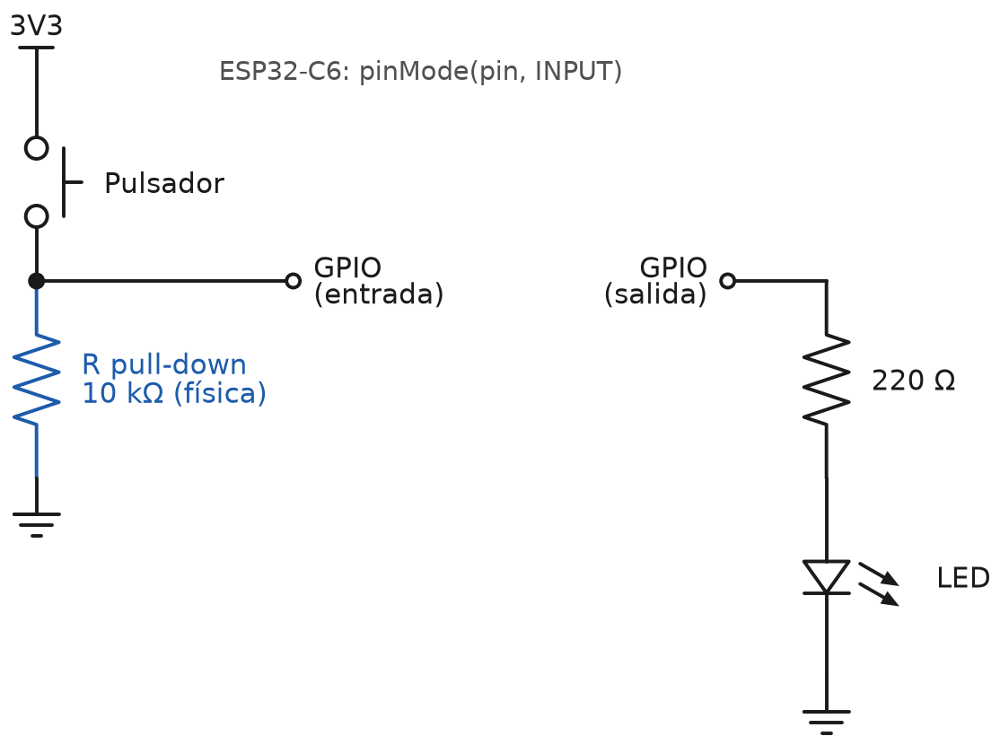
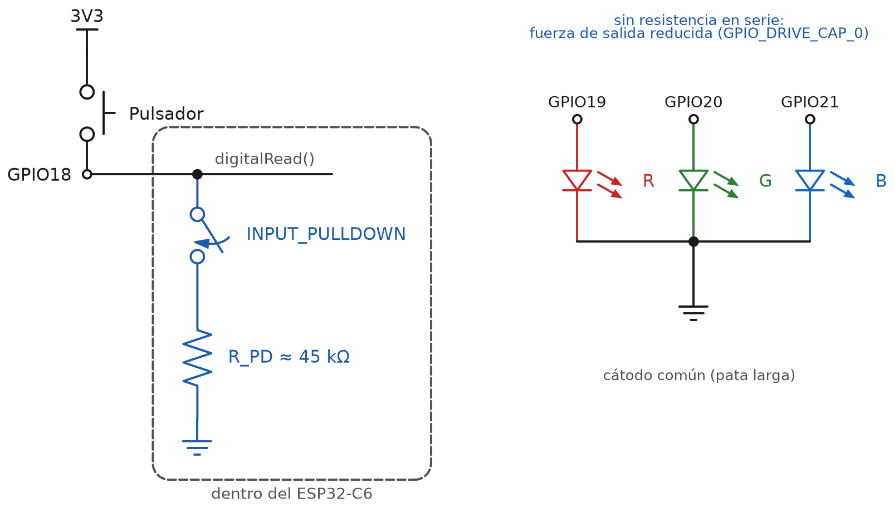
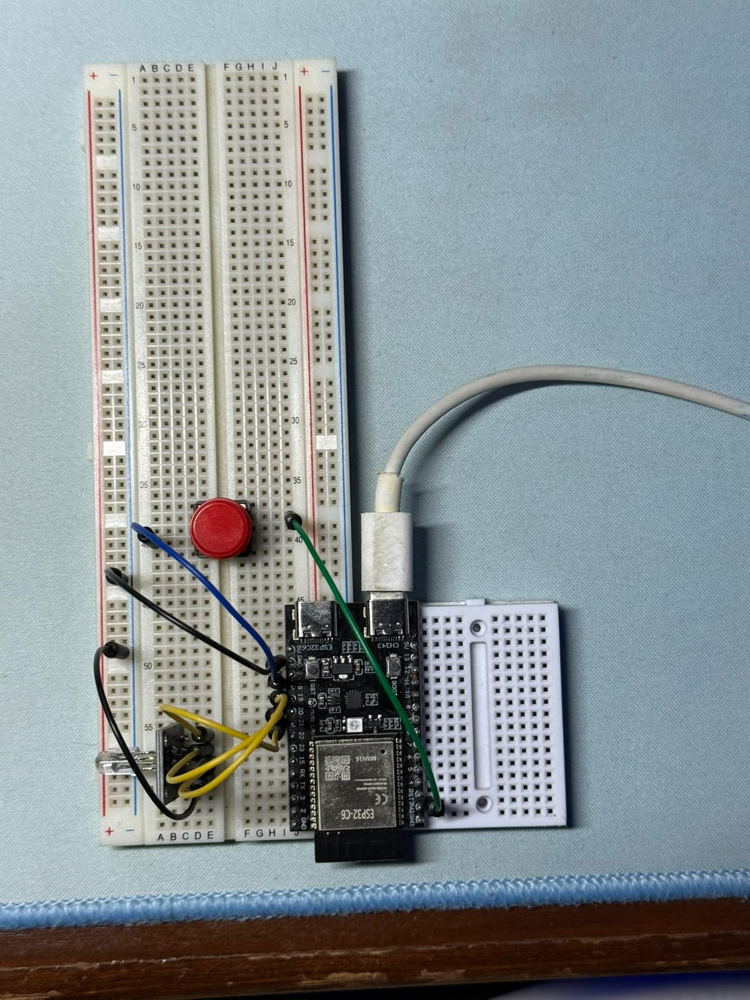
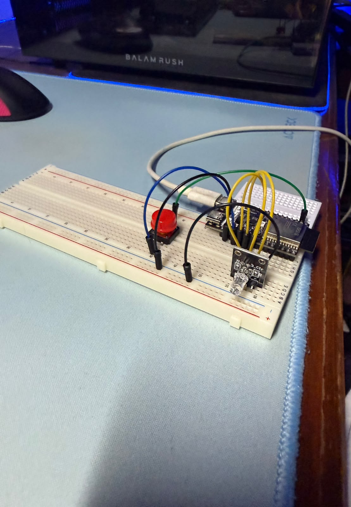
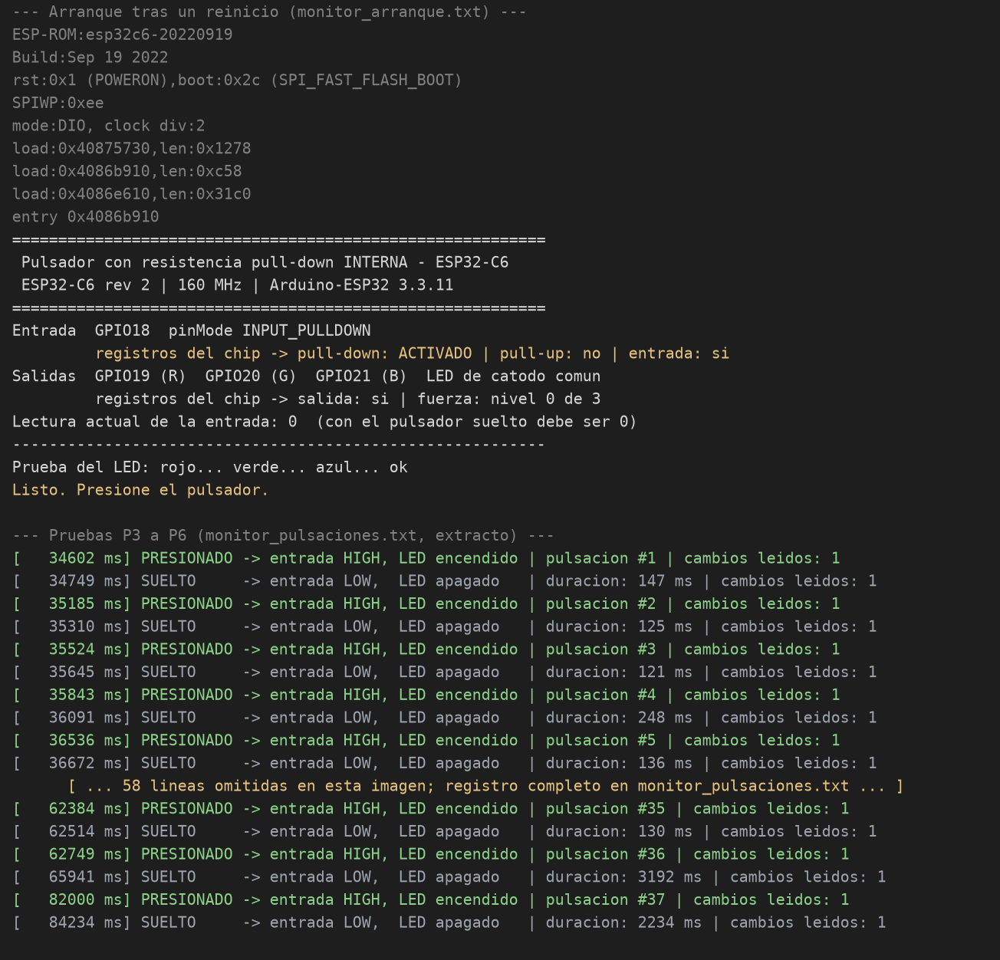

# Informe técnico

## Entrada digital con resistencia pull-down interna (ESP32‑C6)

**Práctica:** repetir el ejercicio de clase (un pulsador en una entrada digital cuyo estado se envía a una salida digital que enciende un LED), pero sustituyendo la resistencia pull-down física por la resistencia pull-down que el ESP32‑C6 integra en sus entradas digitales.

**Código y datos:** ver el `README.md` de esta carpeta.

---

## 1. Objetivo

- Leer el estado de un pulsador en una entrada digital del ESP32‑C6 y copiarlo en una salida digital que enciende un LED.
- Eliminar del circuito la resistencia pull-down física del ejercicio de clase y activar en su lugar la resistencia pull-down interna del pin, por software.
- Comprobar que la resistencia interna queda realmente activada y comparar las dos soluciones.

---

## 2. Fundamento

### 2.1 Por qué una entrada con pulsador necesita pull-down

Una entrada digital CMOS tiene una impedancia altísima: según la hoja de datos del ESP32‑C6, por el pin circulan como mucho **50 nA** y su capacidad es de unos **2 pF**. Con el pulsador abierto, si nada más está conectado al pin, este queda **flotante**: su tensión depende de la carga que acumule y de lo que se acople desde el entorno (la mano, cables cercanos, la red eléctrica). La lectura puede ser 0, 1 o ir cambiando sola.

La resistencia pull-down resuelve el problema uniendo el pin a GND:

- **Pulsador abierto:** la resistencia descarga el pin a 0 V → se lee **LOW**.
- **Pulsador cerrado:** el pulsador une el pin directamente a 3V3, que se impone a la resistencia → se lee **HIGH**.

Es decir, la resistencia solo actúa cuando el pulsador no lo hace, y fija un nivel definido en ese caso.

### 2.2 El circuito de clase

En el ejercicio de clase la resistencia era un componente físico en la protoboard, del pin a GND, y el pin se configuraba como entrada simple (`INPUT`):



*Nota: 10 kΩ y 220 Ω son los valores habituales para este montaje; el razonamiento de este informe no depende del valor exacto usado en clase.*

### 2.3 La resistencia interna del ESP32‑C6

Cada GPIO del ESP32‑C6 incluye una resistencia pull-up y una pull-down débiles, conectables por software. En esta práctica el pulsador sigue entre el pin y 3V3, pero la resistencia a GND está **dentro del chip**:



Datos de la hoja de datos del ESP32‑C6 (v1.5, tabla 5‑4, *DC Characteristics*, 3,3 V y 25 °C):

| Parámetro | Valor | Con VDD = 3,3 V |
|---|---|---|
| R_PD, resistencia pull-down interna | 45 kΩ típico | — |
| R_PU, resistencia pull-up interna | 45 kΩ típico | — |
| V_IH, mínima tensión que se lee como HIGH | 0,75 × VDD | 2,475 V |
| V_IL, máxima tensión que se lee como LOW | 0,25 × VDD | 0,825 V |
| Tensión máxima admisible en un pin | VDD + 0,3 V | 3,6 V |
| I_IL, corriente de entrada en nivel bajo | ≤ 50 nA | — |
| C_IN, capacidad del pin | 2 pF | — |

Dos consecuencias prácticas:

- El pulsador debe ir a **3V3, nunca a 5V**: 5 V superan los 3,6 V admisibles y dañarían el pin.
- La hoja de datos solo da el valor **típico** de 45 kΩ, sin mínimo ni máximo. Sirve para fijar un nivel lógico, no para nada que dependa de su valor exacto.

### 2.4 De `pinMode()` al registro del chip

Toda la diferencia con el código de clase es una palabra:

```cpp
pinMode(PIN_BOTON, INPUT);            // clase: pull-down externo en la protoboard
pinMode(PIN_BOTON, INPUT_PULLDOWN);   // esta práctica: pull-down interno
```

Se ha seguido esa palabra hasta el hardware en el código fuente del core Arduino‑ESP32 3.3.11 y de ESP‑IDF 5.5.5, que es el que se compila:

1. `INPUT_PULLDOWN` vale `0x09`, es decir `INPUT` (`0x01`) más el bit `PULLDOWN` (`0x08`) (`cores/esp32/esp32-hal-gpio.h`).
2. `pinMode()` detecta ese bit y rellena la configuración de ESP‑IDF con `pull_down_en = GPIO_PULLDOWN_ENABLE` antes de llamar a `gpio_config()` (`cores/esp32/esp32-hal-gpio.c`).
3. ESP‑IDF termina en `gpio_ll_pulldown_en()`, que escribe un único bit en el registro del pin (`hal/esp32c6/include/hal/gpio_ll.h`):

```c
REG_SET_BIT(IO_MUX_GPIO0_REG + (gpio_num * 4), FUN_PD);
```

El manual técnico del ESP32‑C6 describe ese bit como `IO_MUX_GPIOn_FUN_WPD`: *«Configures whether or not to enable pull-down resistor of GPIOn. 0: Disable, 1: Enable»*. Es, literalmente, el interruptor de la figura 2.

En ESP‑IDF puro, sin Arduino, lo mismo se escribe `gpio_pulldown_en(GPIO_NUM_18)`.

---

## 3. Materiales

| Material | Cantidad | Nota |
|---|---|---|
| ESP32‑C6‑DevKitC‑1 | 1 | Cualquier placa con ESP32‑C6 sirve cambiando los pines |
| LED RGB de 4 patas | 1 | Cátodo común (lo habitual) o ánodo común, configurable |
| Pulsador táctil | 1 | De 2 o 4 patas |
| Protoboard y cables | — | — |
| Cable USB‑C | 1 | Al conector «USB» de la placa |
| **Resistencias** | **0** | Ese es el objetivo de la práctica |

---

## 4. Desarrollo

### 4.1 Asignación de pines

| Señal | GPIO | Conector de la placa | Motivo de la elección |
|---|---|---|---|
| Pulsador (entrada) | **GPIO18** | J3, pin 10 | GPIO de uso general, sin función especial en el arranque |
| LED rojo (salida) | **GPIO19** | J3, pin 9 | Contiguo al anterior |
| LED verde (salida) | **GPIO20** | J3, pin 8 | Contiguo |
| LED azul (salida) | **GPIO21** | J3, pin 7 | Contiguo |
| Común del LED | **GND** | J3, pin 12 | En el mismo conector |
| Otra pata del pulsador | **3V3** | J1, pin 1 | Nivel alto al pulsar |

Pines descartados a propósito:

- **GPIO4, 5, 8, 9 y 15:** son pines de *strapping*; el chip los lee al arrancar para decidir cómo hacerlo. Un pulsador o un LED en ellos puede impedir el arranque o la grabación.
- **GPIO8**, además, gobierna el LED RGB direccionable (WS2812) integrado en la placa: no es una salida digital simple.
- **GPIO12 y 13:** son las líneas D− y D+ del USB nativo, que se usa para grabar y para el monitor serie.
- **GPIO16 y 17:** TX y RX de la UART0.

### 4.2 Montaje


Pautas del montaje:

- El pulsador, a caballo del canal central de la protoboard. Si es de 4 patas, usar **dos patas en diagonal**: los pares enfrentados ya están unidos por dentro y así se acierta siempre.
- La pata más larga del LED es la **común**. Si el LED es de cátodo común va a GND; si es de ánodo común, a 3V3 (y en el código `LED_ANODO_COMUN = true`).
- Ninguna resistencia: ni en el pulsador (esa es la práctica) ni en el LED (ver 4.3, punto 4).

### 4.3 Programa

El programa completo está en el Anexo A. Su núcleo es el mismo que el del ejercicio de clase: leer la entrada y escribir la salida en cada vuelta de `loop()`.

```cpp
void setup() {
    pinMode(PIN_BOTON, INPUT_PULLDOWN);          // <- el único cambio respecto a clase
    pinMode(PIN_LED_G, OUTPUT);
}

void loop() {
    int lectura = digitalRead(PIN_BOTON);        // 1) leer el estado del pulsador
    escribirLed(lectura == HIGH);                // 2) mandarlo a la salida del LED
    registrarCambios(lectura);                   // 3) informar por el monitor serie
    delay(1);                                    // 4) ceder el núcleo 1 ms
}
```

Decisiones de diseño:

- **1. El LED copia la entrada tal cual.** Como en clase, sin filtrar. El antirrebote de 30 ms se aplica solo al registro por el monitor serie, que así informa de una línea por pulsación en lugar de una por cada rebote del contacto.
- **2. `loop()` cede el núcleo 1 ms en cada vuelta.** En Arduino‑ESP32, `loop()` es una tarea de FreeRTOS; si no se bloquea nunca, deja sin CPU a la tarea *Idle*, que es precisamente lo que se midió en la práctica de multitareas. Leer cada milisegundo es de sobra para un pulsador: el retardo máximo entre pulsar y encenderse el LED es de 1 ms, imperceptible.
- **3. El programa comprueba su propia configuración.** Al arrancar no repite lo que cree haber configurado: lee los registros del chip con `gpio_get_io_config()` (ESP‑IDF 5.5.5) e imprime si el pull-down está activado de verdad, junto con la fuerza de salida de los pines del LED.
- **4. LED sin resistencia: fuerza de salida reducida.** Cada GPIO del C6 tiene cuatro niveles de fuerza de salida; según el manual técnico (campo `FUN_DRV` de `IO_MUX_GPIOn_REG`) son ~5, ~10, ~20 y ~40 mA, y el de por defecto es ~20 mA. Como no se dispone de resistencias, se baja a **~5 mA** (`GPIO_DRIVE_CAP_0`) con `gpio_set_drive_capability()`. Es una limitación nominal, no un limitador de corriente preciso: si se consigue una resistencia de 220–330 Ω por color, conviene ponerla.
- **5. Prueba del LED al arrancar.** Se encienden rojo, verde y azul por turnos. Sirve para comprobar el cableado de los tres canales y si el LED es de ánodo o cátodo común antes de empezar.
- **6. Experimento sin pull-down incluido.** Con la macro `USAR_PULLDOWN_INTERNO = 0` (entorno `sin_pulldown` de PlatformIO), el pin se configura como `INPUT` a secas, sin ninguna resistencia, para observar una entrada flotante (prueba P7).

### 4.4 Compilación

El firmware se ha compilado para el ESP32‑C6 con los dos entornos de PlatformIO:

| Entorno | Resultado | Flash | RAM |
|---|---|---|---|
| `pulldown_interno` (la práctica) | Correcto | 277 454 B (21,2 %) | 15 224 B (4,6 %) |
| `sin_pulldown` (experimento) | Correcto | 277 550 B (21,2 %) | 15 224 B (4,6 %) |

Entorno: PlatformIO con la plataforma *pioarduino* 55.03.311, core Arduino‑ESP32 **3.3.11** (ESP‑IDF 5.5.5) y GCC 14.2.0 para RISC‑V. El mismo `.ino` se abre sin cambios en Arduino IDE.

Dos problemas encontrados al compilar, documentados en el `README.md` para quien reproduzca la práctica:

- El C6 necesita `ARDUINO_USB_MODE=1` además de `ARDUINO_USB_CDC_ON_BOOT=1` para que `Serial` salga por el USB nativo: su USB es el periférico USB‑Serial/JTAG, no un USB OTG. Sin esa opción el core no compila.
- En Windows, las librerías del core 3.3.11 contienen rutas de más de 260 caracteres. Hay que activar las rutas largas de Windows o usar un directorio de PlatformIO con ruta corta.

---

## 5. Pruebas y resultados

### 5.1 Prueba de la lógica del programa en el PC

Antes de ir a la placa se ha comprobado la lógica del programa en el PC. El **mismo `.ino`**, sin copiarlo ni modificarlo, se compila con `g++` contra un Arduino simulado (`pruebas/`) y se le aplica una entrada guionizada de 10 s:

| Caso | Entrada aplicada | Qué debe ocurrir |
|---|---|---|
| A | Pulsación limpia de 400 ms | Una pulsación y una liberación, 1 cambio cada una |
| B | Pulsación con rebotes: 5 cambios al cerrar y 3 al abrir | Una sola pulsación; los rebotes, contados |
| C | Toque de 10 ms, más corto que el antirrebote | Descartado, sin contar como pulsación |
| D | Pulsación larga de 2 s | Una pulsación de 2000 ms |

La prueba comprueba automáticamente tres cosas: que en **cada vuelta** de `loop()` el LED muestra lo que se acaba de leer, que el retardo entre la entrada y el LED no supera un periodo de sondeo, y que el registro serie produce exactamente las líneas esperadas. Salida obtenida (`pruebas/salida_simulacion_pc.txt`):

```
[    2001 ms] PRESIONADO -> entrada HIGH, LED encendido | pulsacion #1 | cambios leidos: 1
[    2401 ms] SUELTO     -> entrada LOW,  LED apagado   | duracion: 400 ms | cambios leidos: 1
[    4001 ms] PRESIONADO -> entrada HIGH, LED encendido | pulsacion #2 | cambios leidos: 5
[    4601 ms] SUELTO     -> entrada LOW,  LED apagado   | duracion: 600 ms | cambios leidos: 3
[    6001 ms] pulso de menos de 30 ms, descartado     | cambios leidos: 2
[    7001 ms] PRESIONADO -> entrada HIGH, LED encendido | pulsacion #3 | cambios leidos: 1
[    9001 ms] SUELTO     -> entrada LOW,  LED apagado   | duracion: 2000 ms | cambios leidos: 1

=== Verificacion automatica ===
Vueltas de loop() simuladas:        8800 (10.0 s)
LED == entrada en cada vuelta:      SI (0 discrepancias)
Cambios de la entrada / del LED:    14 / 14
Retardo maximo entrada -> LED:      700 us (limite: 1000 us)
Eventos del registro correctos:     7 de 7 (registrados: 7)
RESULTADO: OK
```

**Lectura.** La lógica se comporta como se diseñó: el LED sigue a la entrada en las 8800 vueltas, los rebotes del caso B no generan pulsaciones de más y el toque del caso C se descarta. Las marcas de tiempo aparecen 1 ms después del cambio porque en la simulación los cambios caen a 0,3 ms de cada lectura, como pasaría con un pulsador real.

Esta prueba **no dice nada de la electrónica**: no simula el pull-down, ni tensiones, ni el LED físico. Eso solo puede comprobarse en la placa (5.2). Lo que sí garantiza es que, si en la placa algo falla, la causa está en el montaje y no en el programa. El caso C cubre, además, un error real de la primera versión del registro, encontrado al revisar el código y corregido antes de la entrega: un pulso espurio más corto que el antirrebote dejaba el contador a medias y la siguiente pulsación salía con la marca de tiempo equivocada.

### 5.2 Pruebas en la placa

Protocolo, con el monitor serie abierto a 115200 baudios y la placa conectada por el conector «USB»:

| # | Prueba | Resultado esperado | Resultado observado |
|---|---|---|---|
| P1 | Arranque | La cabecera indica `pull-down: ACTIVADO` y `Lectura actual de la entrada: 0` | *pendiente* |
| P2 | Prueba del LED | Rojo, verde y azul se encienden por turnos, uno cada vez | *pendiente* |
| P3 | Pulsador suelto | LED apagado de forma estable, sin líneas nuevas en el monitor | *pendiente* |
| P4 | Pulsador presionado | LED verde encendido mientras se mantiene; línea `PRESIONADO` | *pendiente* |
| P5 | 10 pulsaciones seguidas | 10 líneas `PRESIONADO` numeradas del 1 al 10; anotar los `cambios leidos` | *pendiente* |
| P6 | Mantener 5 s | LED encendido todo el tiempo; `duracion` ≈ 5000 ms | *pendiente* |
| P7 | Experimento sin pull-down | La cabecera indica `pull-down: no`; comportamiento irregular (ver abajo) | *pendiente* |

**Sobre P5.** `cambios leidos` es el número de veces que el programa vio cambiar la entrada durante una transición: 1 si el contacto fue limpio, más de 1 si rebotó. Como se lee cada milisegundo, los rebotes más breves pueden pasar desapercibidos: el número es una **cota inferior** de los rebotes reales.

**Sobre P7.** Con `pio run -e sin_pulldown -t upload` (o `USAR_PULLDOWN_INTERNO 0` en Arduino IDE) el pin queda sin ninguna resistencia. No hay un resultado único que esperar, y eso es justamente lo que se quiere mostrar. Lo habitual es alguna de estas situaciones:

- el LED **se queda encendido después de soltar** el pulsador, porque nada descarga el pin;
- aparecen **pulsaciones o pulsos cortos que nadie ha hecho** al acercar la mano o tocar el cable del GPIO18;
- el LED parpadea o cambia al mover los cables.

Evidencias:









---

## 6. Análisis: resistencia física frente a interna

Para comparar se toma el caso de clase (10 kΩ) y el de esta práctica (45 kΩ típicos). Cálculos con VDD = 3,3 V y los datos de la sección 2.3. La capacidad total del nodo se estima en **~10 pF**: 2 pF del pin según la hoja de datos más la protoboard y el cable.

| Aspecto | Pull-down físico (clase) | Pull-down interno (práctica) |
|---|---|---|
| Componentes externos | 1 resistencia y su cable a GND | Ninguno |
| Valor | 10 kΩ, con tolerancia conocida (típicamente ±5 %) | 45 kΩ típicos, sin tolerancia publicada |
| Tensión en reposo, peor caso (50 nA × R) | 0,5 mV | 2,25 mV |
| Margen hasta V_IL (0,825 V) | 0,82 V | 0,82 V |
| Corriente con el pulsador presionado (3,3 V / R) | 330 µA | **73 µA** |
| Tiempo en caer a V_IL al soltar (R·C·ln 4) | ~0,14 µs | ~0,6 µs |
| Sensibilidad al ruido acoplado (tensión ∝ R) | Referencia | ~4,5 veces mayor |
| Nivel definido desde el encendido | Sí, siempre | Solo desde `pinMode()` |
| Se puede cambiar por software | No | Sí |

**Lectura de la tabla:**

- **Para la lógica, las dos son equivalentes.** En reposo, la tensión del pin se queda en milivoltios en ambos casos, con el mismo margen de sobra hasta los 0,825 V del umbral. Y el pin se descarga al soltar en menos de un microsegundo, más de mil veces por debajo del periodo de lectura de 1 ms.
- **La interna gasta 4,5 veces menos.** Mientras el pulsador está presionado, la corriente de 3V3 a GND a través de la resistencia baja de 330 a 73 µA. En un pulsador de uso ocasional es irrelevante; en un dispositivo IoT a batería con una entrada activa mucho tiempo, no lo es.
- **La física aguanta mejor el ruido.** Una perturbación acoplada al cable induce en el pin una tensión proporcional a la resistencia que lo sujeta: con 45 kΩ, unas 4,5 veces más que con 10 kΩ. Con el pulsador a centímetros de la placa no importa; con cables largos o cerca de motores y relés, una resistencia externa más fuerte (10 kΩ o menos) es la opción segura.
- **La interna no existe hasta que el programa arranca.** Según la tabla 2‑1 de la hoja de datos, el GPIO18 (función SDIO_CMD) tiene durante el reset un **pull-up** débil, no un pull-down, y después queda como entrada sin resistencia hasta que `pinMode()` activa el pull-down. En esta práctica no tiene consecuencias, porque la entrada no se lee hasta entonces. Pero si una entrada debe tener un nivel definido desde el primer instante, por ejemplo porque gobierna algo externo durante el arranque, hace falta la resistencia física.

---

## 7. Conclusiones

1. **La resistencia pull-down interna sustituye a la física sin cambiar el comportamiento del circuito.** Para el programa, el cambio se reduce a una palabra: `INPUT` pasa a ser `INPUT_PULLDOWN`. Para el montaje, desaparece un componente y un cable.
2. **Esa palabra se traduce en un único bit del hardware.** Siguiendo el código del core Arduino y de ESP‑IDF, `INPUT_PULLDOWN` termina activando el bit `FUN_WPD` del registro `IO_MUX_GPIOn_REG` del pin: conecta una resistencia de ~45 kΩ que ya estaba dentro del chip. El firmware lee ese registro al arrancar para confirmar que el cambio se ha aplicado.
3. **Eléctricamente, la interna es suficiente para un pulsador junto a la placa.** Deja el pin en milivoltios en reposo, lejos del umbral de 0,825 V, y lo descarga en menos de un microsegundo. Además consume 4,5 veces menos que un pull-down de 10 kΩ mientras se pulsa.
4. **La física sigue siendo preferible en tres casos:** cables largos o entornos ruidosos, porque la interna es ~4,5 veces más débil; entradas que deben tener un nivel definido desde el encendido, porque la interna solo existe desde `pinMode()`; y circuitos que dependan del valor exacto de la resistencia, porque la interna no tiene tolerancia publicada.
5. **La misma idea resuelve la falta de resistencia del LED, con límites.** Bajar la fuerza de salida del GPIO a ~5 mA reduce la corriente del LED sin componentes externos. Es una limitación nominal, no un sustituto exacto de la resistencia en serie, y así se indica en el código.
6. **Sin ninguna resistencia, la entrada deja de ser fiable.** Un pin flotante no tiene un nivel definido (sección 2.1), así que el estado del LED deja de depender solo del pulsador. El experimento P7 permite observarlo en la placa.

---

## 8. Reproducibilidad

```bash
# Firmware (desde firmware/)
pio run -t upload                  # la práctica: INPUT_PULLDOWN
pio run -e sin_pulldown -t upload  # experimento P7: sin pull-down
pio device monitor                 # 115200 baudios

# Prueba de la lógica en el PC (desde esta carpeta; requiere g++)
bash pruebas/ejecutar.sh

# Figuras y versión Word de este informe
python scripts/generar_figuras.py
cd scripts && npm install && node informe_a_docx.js
```

---

## Anexo A — Código fuente completo

Fichero `firmware/pulsador_pulldown_interno/pulsador_pulldown_interno.ino`. Es el único fichero del programa: se abre tal cual en Arduino IDE y es el que compila PlatformIO.

<!-- incluir: ../firmware/pulsador_pulldown_interno/pulsador_pulldown_interno.ino -->

En GitHub: [pulsador_pulldown_interno.ino](../firmware/pulsador_pulldown_interno/pulsador_pulldown_interno.ino)

## Anexo B — Fuentes

| Documento | Uso en este informe |
|---|---|
| Espressif, *ESP32‑C6 Series Datasheet* v1.5, tabla 5‑4 | R_PD, R_PU, V_IH, V_IL, I_IL, C_IN |
| Espressif, *ESP32‑C6 Series Datasheet* v1.5, tabla 2‑1 | Estado de GPIO18 durante y después del reset |
| Espressif, *ESP32‑C6 Technical Reference Manual*, registro IO_MUX_GPIOn_REG | Bit FUN_WPD y niveles de FUN_DRV (~5/10/20/40 mA) |
| Espressif, *ESP32‑C6‑DevKitC‑1 User Guide* | Orden de pines de J1 y J3, pines de strapping, LED de GPIO8 |
| Código fuente de Arduino‑ESP32 3.3.11 y ESP‑IDF 5.5.5 | Implementación de `pinMode()`, `gpio_config()` y `gpio_ll_pulldown_en()` |
